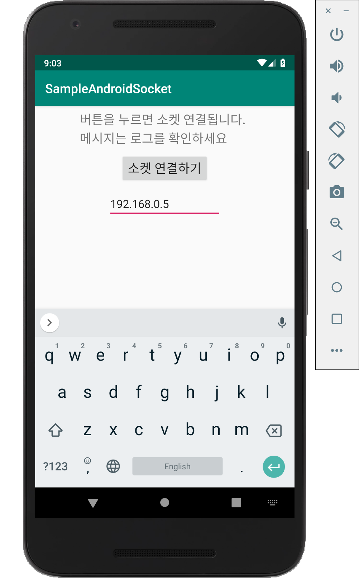
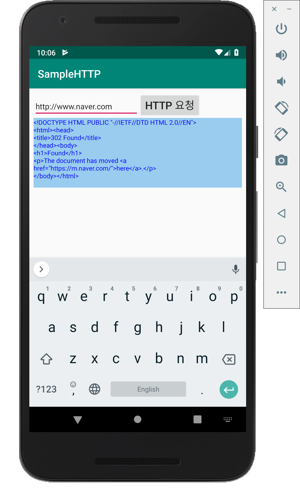
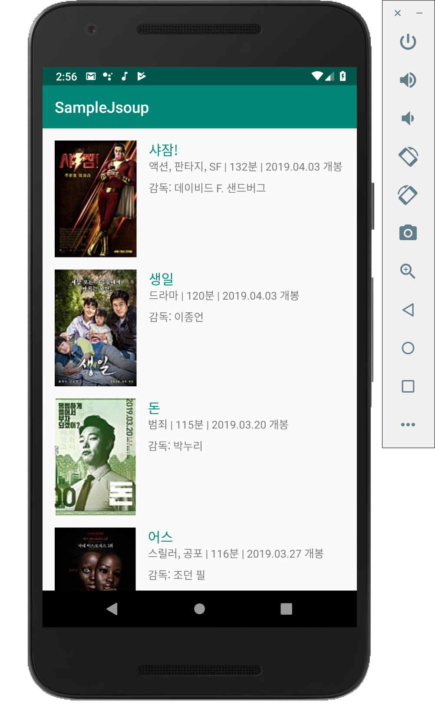

# 08-1. 네트워킹이란?

* **네트워킹** : 인터넷 망에 연결되어 있는 원격지의 서버 또는 원격지의 단말과 통신을 통해 데이터를 주고받는 일반적인 일들.

* **2-tier C/S(Client/Server) 방식** : 클라이언트와 서버가 일대일로 연결하는 방식

* **HTTP, FTP, POP3 프로토콜 이용 방식** : 서버로 간편하게 접속하여 처리하는 것

* **3-tier 방식** : 서버 측의 트래픽 증가 등의 문제를 해결하기 위해 만들어졌고 **부하 분산이나 관리** 등의 목적을 가진 방식. 이 방식을 사용하면 서버를 좀더 유연하게 구성할 수 있고 응용 서버와 데이터 서버로 구성하는 경우에는 **데이터베이스를 분리**시킴으로써 중간에 **비즈니스 로직(Business Logic)을** 처리하는 **응용 서버가 다양한 역할**을 할 수 있다.

* **P2P(Peer to Peer) 모델** : **단말끼리** 서버와 클라이언트 역할을 하면서 통신. 정보 검색이나 파일 송수신을 통한 정보 공유. (ex 메신저)

* **미들웨어(Middleware)** : 시스템들 간의 공통된 통신 방식이나 **지능화된 네트워크 서비스**를 제공하기 위해 만들어짐. 안드로이드에는 이러한 미들웨어 기술 중의 일부가 **프로세스 간 통신(IPC)**에 적용되어 있다.

  

# 08-2. 소켓 이용하기

* **TCP와 UDP** : IP 주소를 이용해 목적지 호스트를 찾아내고 포트를 이용해 통신 접속점을 찾아내는 **소켓 연결 방식.**
* **HTTP 프로토콜** : **비연결성(Sateless)**으로써 응답을 받고난 후 연결을 끊게 되므로 소켓 연결을 더 선호한다.
* 안드로이드에서는 소켓 연결을 시도하거나 응답을 받아 처리할 때 **스레드를** 사용해야 한다.


## 클라이언트와 안드로이드의 소켓 통신(예제)

### IntelliJ 에서 소켓 통신

* **JavaSocketClient.java**

  ```java
  package org.techtown.socket;
  
  import java.io.ObjectInputStream;
  import java.io.ObjectOutputStream;
  import java.net.Socket;
  
  public class JavaSocketClient {
  
      public static void main(String[] args) {
          try {
              int portNumber = 5001;
  
              // 소켓 연결을 위한 Socket 객체 생성
              // 접속할 IP 주소는 localhost
              // 포트는 5001번
              Socket sock = new Socket("localhost", portNumber);
  
              // 데이터를 쓰기 위한 스트림 객체를 만들고 데이터 쓰기
              // getOutputStream() 메소드를 통해 데이터를 보낸다.
              ObjectOutputStream outStream = new ObjectOutputStream(sock.getOutputStream());
              outStream.writeObject("Hello Android Town");
              outStream.flush();
  
              // 데이터를 읽기 위한 스트림 객체를 만들고 데이터 읽기
              // getInputStream() 메소드를 통해 데이터를 받는다.
              ObjectInputStream instream = new ObjectInputStream(sock.getInputStream());
              System.out.println(instream.readObject());
              sock.close();
  
          } catch (Exception ex) {
              ex.printStackTrace();
          }
      }
  }
  ```

* **JavaSocketServer.java**

  ```java
  package org.techtown.socket;
  
  import java.io.ObjectInputStream;
  import java.io.ObjectOutputStream;
  import java.net.InetAddress;
  import java.net.ServerSocket;
  import java.net.Socket;
  
  public class JavaSocketServer {
  
      public static void main(String[] args) {
          try {
              int portNumber = 5001;
  
              System.out.println("Starting Java Socket Server ...");
              // 소켓 연결을 수신하기 위한 ServerSocket 객체 생성
              ServerSocket aServerSocket = new ServerSocket(portNumber);
              System.out.println("Listening at port " + portNumber + " ...");
  
              // 반목문을 이용해 클라이언트 연결 대기
              while (true) {
                  // 클라이언트 연결 시 소켓 객체 참조
                  // accept() 메소드를 통해 리턴되는 소켓 객체로
                  // 클라이언트 소켓의 연결 정보 확인
                  Socket sock = aServerSocket.accept();
                  InetAddress clientHost = sock.getLocalAddress();
                  int clientPort = sock.getPort();
                  System.out.println("A client connected. host : " + clientHost +
                          ", port : " + clientPort);
  
                  // 데이터를 읽기 위한 스트림 객체를 만들고 데이터 읽기
                  ObjectInputStream instream = new ObjectInputStream(sock.getInputStream());
                  Object obj = instream.readObject();
                  System.out.println("Input : " + obj);
  
                  // 데이터를 쓰기 위한 스트림 객체를 만들고 데이터 쓰기
                  ObjectOutputStream outstream = new ObjectOutputStream(sock.getOutputStream());
                  outstream.writeObject(obj + "from Server.");
                  outstream.flush();
                  sock.close();
              }
          } catch (Exception ex) {
              ex.printStackTrace();
          }
      }
  }
  ```

* **실행 결과**

  JavaSocketServer 실행 결과

  ```
  Starting Java Socket Server ...
  Listening at port 5001 ...
  A client connected. host : /127.0.0.1, port : 52953
  Input : Hello Android Town
  ```

  JavaSocketClient 실행 결과

  ```
  Hello Android Townfrom Server.
  ```

  

### Anroid에서 소켓 통신

* **/res/layout/activity_main.xml**

  ```xml
  <?xml version="1.0" encoding="utf-8"?>
  <android.support.constraint.ConstraintLayout xmlns:android="http://schemas.android.com/apk/res/android"
      xmlns:app="http://schemas.android.com/apk/res-auto"
      xmlns:tools="http://schemas.android.com/tools"
      android:layout_width="match_parent"
      android:layout_height="match_parent"
      tools:context=".MainActivity">
  
      <LinearLayout
          android:layout_width="match_parent"
          android:layout_height="match_parent"
          android:layout_marginStart="8dp"
          android:layout_marginLeft="8dp"
          android:layout_marginTop="8dp"
          android:layout_marginEnd="8dp"
          android:layout_marginRight="8dp"
          android:layout_marginBottom="8dp"
          android:orientation="vertical"
          app:layout_constraintBottom_toBottomOf="parent"
          app:layout_constraintEnd_toEndOf="parent"
          app:layout_constraintStart_toStartOf="parent"
          app:layout_constraintTop_toTopOf="parent">
  
          <TextView
              android:layout_width="wrap_content"
              android:layout_height="wrap_content"
              android:layout_gravity="center_horizontal"
              android:text="버튼을 누르면 소켓 연결됩니다.\n메시지는 로그를 확인하세요"
              android:textSize="20dp" />
  
          <Button
              android:id="@+id/connectButton"
              android:text="소켓 연결하기"
              android:textSize="20dp"
              android:layout_gravity="center_horizontal"
              android:layout_marginTop="10dp"
              android:layout_width="wrap_content"
              android:layout_height="wrap_content" />
  
          <EditText
              android:id="@+id/editText"
              android:layout_gravity="center_horizontal"
              android:layout_marginTop="10dp"
              android:layout_width="180dp"
              android:layout_height="wrap_content" />
  
      </LinearLayout>
  
  
  </android.support.constraint.ConstraintLayout>
  ```

* **/java/com~/MainActivity.java**

  ```java
  package com.example.sampleandroidsocket;
  
  import android.support.v7.app.AppCompatActivity;
  import android.os.Bundle;
  import android.util.Log;
  import android.view.View;
  import android.widget.Button;
  import android.widget.EditText;
  import android.widget.Toast;
  
  import java.io.ObjectInputStream;
  import java.io.ObjectOutputStream;
  import java.net.Socket;
  
  public class MainActivity extends AppCompatActivity {
  
      Button button;
      EditText editText;
  
      @Override
      protected void onCreate(Bundle savedInstanceState) {
          super.onCreate(savedInstanceState);
          setContentView(R.layout.activity_main);
  
          editText = findViewById(R.id.editText);
  
          button = findViewById(R.id.connectButton);
          button.setOnClickListener(new View.OnClickListener() {
              @Override
              public void onClick(View v) {
                  String addr = editText.getText().toString().trim();
  
                  ConnectThread thread = new ConnectThread(addr);
                  thread.start();
              }
          });
      }
  
      class ConnectThread extends Thread {
          String hostname;
  
          public ConnectThread(String addr) {
              hostname = addr;
          }
  
          public void run() {
              try {
                  int port = 11001;
                  // [표준 자바와 동일] 소켓 연결을 위한
                  // Socket 객체 생성
                  Socket sock = new Socket(hostname, port);
  
                  // [표준 자바와 동일] 데이터를 쓰기 위한
                  // 스트림 객체를 만들고 데이터 쓰기
                  ObjectOutputStream outStream = new ObjectOutputStream(sock.getOutputStream());
                  outStream.writeObject("Hello AndroidTown on Android");
                  outStream.flush();
  
                  // [표준 자바와 동일] 데이터를 읽기 위한 스트림
                  // 객체를 만들고 데이터 읽기
                  ObjectInputStream instream = new ObjectInputStream(sock.getInputStream());
                  String obj = (String) instream.readObject();
  
                  // 소켓에서 읽은 데이터를 로그로 출력하기
                  Log.d("MainActivity", "서버에서 받은 메시지 : " + obj);
  
                  Toast.makeText(getApplicationContext(), "\"서버에서 받은 메시지 : \" + obj", Toast.LENGTH_SHORT).show();
  
                  sock.close();
              } catch (Exception ex) {
                  ex.printStackTrace();
              }
          }
      }
  
  }
  ```

* **/manifests**

  ```xml
  <?xml version="1.0" encoding="utf-8"?>
  <manifest xmlns:android="http://schemas.android.com/apk/res/android"
      package="com.example.sampleandroidsocket">
  
      <!--인터넷 사용 권한 등록-->
      <uses-permission android:name="android.permission.INTERNET"></uses-permission>
  
      <application
          android:allowBackup="true"
          android:icon="@mipmap/ic_launcher"
          android:label="@string/app_name"
          android:roundIcon="@mipmap/ic_launcher_round"
          android:supportsRtl="true"
          android:theme="@style/AppTheme">
          <activity android:name=".MainActivity">
              <intent-filter>
                  <action android:name="android.intent.action.MAIN" />
  
                  <category android:name="android.intent.category.LAUNCHER" />
              </intent-filter>
          </activity>
      </application>
  
  </manifest>
  ```

* **실행 결과**

  


# 08-3. 웹으로 요청하기

* **HTTP** 를 이용해 웹서버에 접속하는 것도 소켓의 경우와 마찬가지로 표준 자바의 방식을 그대로 사용할 수 있다. 자바에서 HTTP 클라이언트를 만드는 가장 간단한 방법은 **URL 객체** 를 만들고 이 객체의 **openConnection() 메소드** 를 호출하여 **HttpURLConnection** 객체를 만드든 것 이다.

  ```java
  public URLConnection openConnection()
  ```

* URL 객체에 들어 있는 문자열이 **http://** 를 포함하게 되면 HTTP 연결을 위한 객체를 만들게 되므로 **openConnection() 메소드** 가 리턴하는 **URLConnection** 객체를 **HttpURLConnection** 으로 타입을 바꾸어(Type casting) 사용할 수 있다.

   HttpURLConnection 객체를 이용해 연결할 경우에는 **GET** 이나 **POST** 와 같은 요청 방식과 함께 요청을 위한 파라미터들을 설정할 수 있다.

  ```java
  // 요청 방식을 지정하는 메소드로 GET 이나 POST 문자열을 파라미터로 전달
  public void setRequestMethod(String method);
  // 요청할 때 헤더에 들어가는 필드 값을 지정할 수 있도록 한다.
  public void setRequestProperty(String field, String newValue);
  ```


## GET 방식을 사용하여 웹페이지 내용 가져오기(예제)

* **/manifests.xml**

  ```xml
  <?xml version="1.0" encoding="utf-8"?>
  <manifest xmlns:android="http://schemas.android.com/apk/res/android"
      package="com.example.samplehttp">
  
      <!--인터넷 접속 권한 허용-->
      <uses-permission android:name="android.permission.INTERNET"></uses-permission>
      <!--android:supportsRtl="true" 추가-->
      <application
          android:allowBackup="true"
          android:usesCleartextTraffic="true"
          android:icon="@mipmap/ic_launcher"
          android:label="@string/app_name"
          android:roundIcon="@mipmap/ic_launcher_round"
          android:supportsRtl="true"
          android:theme="@style/AppTheme">
          <activity android:name=".MainActivity">
              <intent-filter>
                  <action android:name="android.intent.action.MAIN" />
  
                  <category android:name="android.intent.category.LAUNCHER" />
              </intent-filter>
          </activity>
      </application>
  </manifest>
  ```

* **/res/layout/activity_main.xml**

  ```xml
  <?xml version="1.0" encoding="utf-8"?>
  <android.support.constraint.ConstraintLayout xmlns:android="http://schemas.android.com/apk/res/android"
      xmlns:app="http://schemas.android.com/apk/res-auto"
      xmlns:tools="http://schemas.android.com/tools"
      android:layout_width="match_parent"
      android:layout_height="match_parent"
      tools:context=".MainActivity">
  
      <LinearLayout
          android:layout_width="match_parent"
          android:layout_height="match_parent"
          android:layout_marginStart="8dp"
          android:layout_marginLeft="8dp"
          android:layout_marginTop="8dp"
          android:layout_marginEnd="8dp"
          android:layout_marginRight="8dp"
          android:layout_marginBottom="8dp"
          android:orientation="vertical"
          app:layout_constraintBottom_toBottomOf="parent"
          app:layout_constraintEnd_toEndOf="parent"
          app:layout_constraintStart_toStartOf="parent"
          app:layout_constraintTop_toTopOf="parent">
  
          <LinearLayout
              android:orientation="horizontal"
              android:layout_width="wrap_content"
              android:layout_height="wrap_content">
  
              <EditText
                  android:id="@+id/editAddressText"
                  android:layout_width="200dp"
                  android:textSize="15dp"
                  android:hint="http://"
                  android:layout_height="wrap_content" />
  
              <Button
                  android:id="@+id/requestButton"
                  android:text="HTTP 요청"
                  android:textSize="20dp"
                  android:layout_width="wrap_content"
                  android:layout_height="wrap_content" />
  
          </LinearLayout>
  
          <ScrollView
              android:layout_width="wrap_content"
              android:layout_height="wrap_content">
  
              <TextView
                  android:id="@+id/txtMsg"
                  android:background="#ff99ccee"
                  android:textColor="#ff0000ff"
                  android:textSize="12dp"
                  android:layout_width="match_parent"
                  android:layout_height="match_parent" />
  
          </ScrollView>
  
      </LinearLayout>
  
  </android.support.constraint.ConstraintLayout>
  ```

* **/java/com~/MainActivity.java**

  ```java
  package com.example.samplehttp;
  
  import android.os.Handler;
  import android.support.v7.app.AppCompatActivity;
  import android.os.Bundle;
  import android.util.Log;
  import android.view.View;
  import android.widget.Button;
  import android.widget.EditText;
  import android.widget.TextView;
  
  import java.io.BufferedReader;
  import java.io.InputStreamReader;
  import java.net.HttpURLConnection;
  import java.net.URL;
  
  public class MainActivity extends AppCompatActivity {
  
      public static String defaultUrl = "http://m.naver.com";
      Handler handler = new Handler();
  
      EditText editAddress;
      Button requestButton;
      TextView textView;
  
      @Override
      protected void onCreate(Bundle savedInstanceState) {
          super.onCreate(savedInstanceState);
          setContentView(R.layout.activity_main);
  
          editAddress = findViewById(R.id.editAddressText);
          requestButton = findViewById(R.id.requestButton);
          textView = findViewById(R.id.txtMsg);
  
          requestButton.setOnClickListener(new View.OnClickListener() {
              @Override
              public void onClick(View v) {
                  // 입력상자에 입력된 URL 문자열 참조
                  String urlStr = editAddress.getText().toString();
  
                  // 웹으로 요청하기 위한 새로 정의한 스레드 객체 생성 및 시작
                  ConnectThread thread = new ConnectThread(urlStr);
                  thread.start();
              }
          });
      }
  
      class ConnectThread extends Thread {
  
          String urlStr;
  
          public ConnectThread(String urlStr) {
              this.urlStr = urlStr;
          }
  
          @Override
          public void run() {
              try {
                  // 새로 정의한 request() 메소드 호출
                  final String output = request(urlStr);
  
                  // URL 구성요소 중의 하나인 텍스트뷰에
                  // 보여주어야 하므로 핸들러 객체의
                  // post 메소드를 호출
                  handler.post(new Runnable() {
                      @Override
                      public void run() {
                          textView.setText(output);
                      }
                  });
              } catch (Exception ex) {
                  ex.printStackTrace();
              }
          }
  
          private String request(String urlStr) {
              StringBuilder output = new StringBuilder();
  
              try {
                  // URL 문자열을 이용해 URL 객체 생성
                  URL url = new URL(urlStr);
  
                  // URL 객체를 이용해 HttpURLConnection 객체 생성
                  HttpURLConnection conn = (HttpURLConnection) url.openConnection();
  
                  if (conn != null) {
                      // 연결 대기 시간을 10초로 설정
                      conn.setConnectTimeout(10000);
                      // GET 방식으로 요청한다는 내용을 설정
                      conn.setRequestMethod("GET");
                      // 객체의 입력과 출력이 가능하도록 만들어준다.
                      conn.setDoInput(true);
                      conn.setDoOutput(true);
  
                      // 응답 결과를 읽기 위한 스트림 객체 생성
                      BufferedReader reader = new BufferedReader(new InputStreamReader(conn.getInputStream()));
  
                      String line = null;
  
                      while (true) {
                          // 반복문 안에서 한 줄씩 읽어 결과 문자열에 추가
                          line = reader.readLine();
                          if (line == null) {
                              break;
                          }
                          output.append(line + "\n");
                      }
                      reader.close();
                      conn.disconnect();
                  }
  
              } catch (Exception ex) {
                  Log.e("SampleHTTP", "Exception in processing response.", ex);
              }
              return output.toString();
          }
      }
  }
  ```

* **실행 결과**

  


# 08-4. 인터넷 정보 가져오기

* **RSS(Really Simple Syndication)** : 자주 바뀌는 내용을 제공하기 위해 사용되는 **표준 웹 피즈(Feed) 포맷**이다. RSS는 최신 연예 뉴스나 스포츠 뉴스를 사용자에게 보여주고 싶을 때 애플리케이션에서 간단하게 연동하여 사용할 수 있다. RSS 문서에는 뉴스외 제목과 내용 그리고 만든 날짜 등과 함께 **RSS 채널 자체의 정보가 메타데이터**로 들어있다.

* RSS 문서의 소스를 보면 **XML**로 되어있기 때문에 그 내용을 파싱한 후 화면에 보여주면 된다. XML 문서를 파싱하는 방법은 여러 가지가 있으나 대표적으로 **DOM(Document Object Model)**과 **SAX(Simple API for XML) 파서**가 있다.

* **SAX 파서** : 문서의 내용을 순차적으로 읽어 들이면서 각각의 노드들을 파악해 나가는 방식을 사용

* **DOM 파서** : 전체 문서를 모두 읽어 들인 후 전체 노드들 중에서 필요한 노드를 찾아 처리할 수 있다.

* **DOM 파서를 이용해 파싱한 문서의 대표적인 노드**

  | 노드 이름 | 설 명                                                        |
  | --------- | ------------------------------------------------------------ |
  | Document  | DOM 문서를 나타내는 최상위 노드                              |
  | Element   | 문서 안에 들어 있는 태그를 나타내는 노드<br />\<item><br />...<br />\</item> |
  | Attr      | 태그의 속성값<br />\<item name="기사"><br />...<br />\<item> |

* RSS 문서는 하나의 뉴스 정보를 하나의 \<item> 태그로 표현하므로 하나의 RSS 사이트는 여러 개의 \<item> 태그로 나열되어 보일 수 있다.


## 네이버 영화 정보 가져오기(예제)

* **/Gradle Sripts/build.gradle**

  ```javascript
  apply plugin: 'com.android.application'
  
  android {
      compileSdkVersion 28
      defaultConfig {
          applicationId "com.example.samplejsoup"
          minSdkVersion 15
          targetSdkVersion 28
          versionCode 1
          versionName "1.0"
          testInstrumentationRunner "android.support.test.runner.AndroidJUnitRunner"
      }
      buildTypes {
          release {
              minifyEnabled false
              proguardFiles getDefaultProguardFile('proguard-android-optimize.txt'), 'proguard-rules.pro'
          }
      }
  }
  
  dependencies {
      implementation fileTree(include: ['*.jar'], dir: 'libs')
      // jsoup 추가
      implementation 'org.jsoup:jsoup:1.11.3'
      implementation 'com.android.support:appcompat-v7:28.0.0'
      implementation 'com.android.support.constraint:constraint-layout:1.1.3'
      testImplementation 'junit:junit:4.12'
      androidTestImplementation 'com.android.support.test:runner:1.0.2'
      androidTestImplementation 'com.android.support.test.espresso:espresso-core:3.0.2'
      implementation 'com.android.support:design:28.0.0'
      implementation 'com.android.support:appcompat-v7:28.0.0'
      implementation 'com.github.bumptech.glide:glide:4.9.0'
      implementation 'com.github.bumptech.glide:gifdecoder:4.9.0'
      implementation 'com.github.bumptech.glide:recyclerview-integration:4.9.0'
  }
  ```

* **/manifests/AndroidManifest.xml**

  ```xml
  <?xml version="1.0" encoding="utf-8"?>
  <manifest xmlns:android="http://schemas.android.com/apk/res/android"
      package="com.example.samplejsoup">
  
      <!--권한 추가-->
      <uses-permission android:name="android.permission.INTERNET" />
      <uses-permission android:name="android.permission.WRITE_EXTERNAL_STORAGE" />
      <uses-permission android:name="android.permission.ACCESS_WIFI_STATE" />
      <uses-permission android:name="android.permission.CHANGE_WIFI_STATE" />
      <uses-permission android:name="android.permission.CHANGE_NETWORK_STATE" />
      <uses-permission android:name="android.permission.ACCESS_NETWORK_STATE" />
  
    <!-- usesCleartextTraffic="true" 필수-->
      <application
          android:usesCleartextTraffic="true"
          android:allowBackup="true"
          android:icon="@mipmap/ic_launcher"
          android:label="@string/app_name"
          android:roundIcon="@mipmap/ic_launcher_round"
          android:supportsRtl="true"
          android:theme="@style/AppTheme">
          <activity android:name=".MainActivity">
              <intent-filter>
                  <action android:name="android.intent.action.MAIN" />
  
                  <category android:name="android.intent.category.LAUNCHER" />
              </intent-filter>
          </activity>
      </application>
  
  </manifest>
  ```

* **/res/layout/activity_main.xml**

  ```xml
  <?xml version="1.0" encoding="utf-8"?>
  <android.support.constraint.ConstraintLayout xmlns:android="http://schemas.android.com/apk/res/android"
      xmlns:app="http://schemas.android.com/apk/res-auto"
      xmlns:tools="http://schemas.android.com/tools"
      android:layout_width="match_parent"
      android:layout_height="match_parent"
      tools:context=".MainActivity">
  
      <!--RecyclerView 추가-->
      <android.support.v7.widget.RecyclerView
          android:id="@+id/recyclerView"
          android:layout_width="match_parent"
          android:layout_height="match_parent">
  
      </android.support.v7.widget.RecyclerView>
  
  
  </android.support.constraint.ConstraintLayout>
  ```

* **/res/layout/item.xml**

  ```xml
  <?xml version="1.0" encoding="utf-8"?>
  <android.support.constraint.ConstraintLayout xmlns:android="http://schemas.android.com/apk/res/android"
      android:layout_width="match_parent"
      android:layout_height="wrap_content"
      xmlns:app="http://schemas.android.com/apk/res-auto">
  
      <!--영화제목/이미지url/상세보기링크/개봉일/감독-->
      <ImageView
          android:id="@+id/imageView_img"
          android:layout_width="wrap_content"
          android:layout_height="wrap_content"
          android:layout_marginStart="16dp"
          android:layout_marginTop="16dp"
          app:layout_constraintStart_toStartOf="parent"
          app:layout_constraintTop_toTopOf="parent"
          app:srcCompat="@mipmap/ic_launcher"
          android:layout_marginLeft="16dp" />
  
      <TextView
          android:id="@+id/textView_title"
          android:layout_width="wrap_content"
          android:layout_height="wrap_content"
          android:layout_marginStart="16dp"
          android:layout_marginTop="16dp"
          android:paddingRight="8dp"
          android:text="영화제목"
          android:textSize="18dp"
          android:textColor="@color/colorPrimary"
          app:layout_constraintStart_toEndOf="@+id/imageView_img"
          app:layout_constraintTop_toTopOf="parent"
          android:layout_marginLeft="16dp" />
  
      <TextView
          android:id="@+id/textView_release"
          android:layout_width="wrap_content"
          android:layout_height="wrap_content"
          android:layout_marginStart="16dp"
          android:text="개봉일"
          app:layout_constraintStart_toEndOf="@+id/imageView_img"
          app:layout_constraintTop_toBottomOf="@+id/textView_title"
          android:layout_marginLeft="16dp" />
  
      <TextView
          android:id="@+id/textView_director"
          android:layout_width="wrap_content"
          android:layout_height="wrap_content"
          android:layout_marginStart="16dp"
          android:layout_marginTop="28dp"
          android:text="감독"
          app:layout_constraintStart_toEndOf="@+id/imageView_img"
          app:layout_constraintTop_toTopOf="@+id/textView_release"
          android:layout_marginLeft="16dp" />
  
  </android.support.constraint.ConstraintLayout>
  ```

* **/java/com~/ItemObject.java**

  ```java
  package com.example.samplejsoup;
  
  public class ItemObject {
  
      private String title;
      private String img_url;
      private String detail_link;
      private String release;
      private String director;
  
      public ItemObject(String title, String url, String link, String release, String director) {
          this.title = title;
          this.img_url = url;
          this.detail_link = link;
          this.release = release;
          this.director = director;
      }
  
      public String getTitle() {
          return title;
      }
  
      public String getImg_url() {
          return img_url;
      }
  
      public String getDetail_link() {
          return detail_link;
      }
  
      public String getRelease() {
          return release;
      }
  
      public String getDirector() {
          return director;
      }
  }
  ```

* **/java/com~/MyAdapter.java**

  ```java
  package com.example.samplejsoup;
  
  import android.support.annotation.NonNull;
  import android.support.v7.widget.RecyclerView;
  import android.view.LayoutInflater;
  import android.view.View;
  import android.view.ViewGroup;
  import android.widget.ImageView;
  import android.widget.TextView;
  
  import com.bumptech.glide.Glide;
  
  import java.util.ArrayList;
  
  public class MyAdapter extends RecyclerView.Adapter<MyAdapter.ViewHolder> {
  
      // 데이터 배열 선언
      private ArrayList<ItemObject> mList;
  
      // View 참조 클래스
      public class ViewHolder extends RecyclerView.ViewHolder{
  
          private ImageView imageView_img;
          private TextView textView_title, textView_release, textView_director;
  
          public ViewHolder(@NonNull View itemView) {
              super(itemView);
  
              imageView_img = itemView.findViewById(R.id.imageView_img);
              textView_title = itemView.findViewById(R.id.textView_title);
              textView_release = itemView.findViewById(R.id.textView_release);
              textView_director = itemView.findViewById(R.id.textView_director);
          }
      }
  
      // 생성자
      public MyAdapter(ArrayList<ItemObject> list) {
          this.mList = list;
      }
  
  
      @NonNull
      @Override
      // View 가 생성되었을 때 호출
      public MyAdapter.ViewHolder onCreateViewHolder(@NonNull ViewGroup viewGroup, int i) {
          // View 인플레이터
          View view = LayoutInflater.from(viewGroup.getContext()).inflate(R.layout.item, viewGroup, false);
  
          return new ViewHolder(view);
      }
  
      @Override
      // 각 위치에 맞는 데이터 대입
      public void onBindViewHolder(@NonNull MyAdapter.ViewHolder viewHolder, int i) {
          viewHolder.textView_title.setText(String.valueOf(mList.get(i).getTitle()));
          viewHolder.textView_release.setText(String.valueOf(mList.get(i).getRelease()));
          viewHolder.textView_director.setText(String.valueOf(mList.get(i).getDirector()));
  
          // build.gradle 에 아래 주석추가
          // implementation 'com.github.bumptech.glide:glide:4.9.0'
          Glide.with(viewHolder.itemView).load(mList.get(i).getImg_url())
                  .override(300, 400)
                  .into(viewHolder.imageView_img);
      }
  
      @Override
      // 아이템 개수 리턴 메소드
      public int getItemCount() {
          return mList.size();
      }
  
  }
  ```

* **/java/com~/MyAppGlideModule.java**

   Glide 모듈 사용시 오류가 날때 추가

  ```java
  package com.example.samplejsoup;
  
  
  import com.bumptech.glide.annotation.GlideModule;
  import com.bumptech.glide.module.AppGlideModule;
  
  @GlideModule
  public final class MyAppGlideModule extends AppGlideModule {
  }
  ```

* **/java/com~/MainActivity.java**

  ```java
  package com.example.samplejsoup;
  
  import android.app.ProgressDialog;
  import android.os.AsyncTask;
  import android.support.v7.app.AppCompatActivity;
  import android.os.Bundle;
  import android.support.v7.widget.LinearLayoutManager;
  import android.support.v7.widget.RecyclerView;
  import android.util.Log;
  
  import org.jsoup.Jsoup;
  import org.jsoup.nodes.Document;
  import org.jsoup.nodes.Element;
  import org.jsoup.select.Elements;
  
  import java.io.IOException;
  import java.util.ArrayList;
  
  public class MainActivity extends AppCompatActivity {
  
      private RecyclerView recyclerView;
      private ArrayList<ItemObject> list = new ArrayList<>();
  
      @Override
      protected void onCreate(Bundle savedInstanceState) {
          super.onCreate(savedInstanceState);
          setContentView(R.layout.activity_main);
  
          recyclerView = findViewById(R.id.recyclerView);
  
          // AsyncTask 작동시킨다.(파싱)
          new Description().execute();
      }
  
      private class Description extends AsyncTask<Void, Void, Void> {
  
          // 진행바 표시
          private ProgressDialog progressDialog;
  
          @Override
          protected void onPreExecute() {
  
              super.onPreExecute();
  
              // 진행 다이어로그 시작
              progressDialog = new ProgressDialog(MainActivity.this);
              progressDialog.setProgressStyle(ProgressDialog.STYLE_SPINNER);
              progressDialog.setMessage("잠시 기다려 주세요.");
              progressDialog.show();
  
          }
  
          @Override
          protected Void doInBackground(Void... voids) {
  
              try {
                  Document doc = Jsoup.connect("https://movie.naver.com/movie/running/current.nhn").get();
  
                  // <ul class="lst_detail_t1"> 태그의 <li> 태그를 선택한다.
                  Elements mElementDataSize = doc.select("ul[class=lst_detail_t1]").select("li");
  
                  // mElementDataSize 에 저장된 <li> 요소들을 하나씩 가져온다.
                  for(Element elem : mElementDataSize){
                      // <li> 에서 다시 원하는 데이터를 추출해 낸다.
  
                      // <li> 안에 <dt class="tit"> 안에 <a> 태그의 text 가져옴.
                      String my_title = elem.select("li dt[class=tit] a").text();
  
                      // <li> 안에 <div class="thumb"> 안에 <a> 태그의 href 링크값을 가져옴
                      String my_link = elem.select("li div[class=thumb] a").attr("href");
  
                      // <li> 안에 <div class="thumb"> 안에 <a> 태그안에  태그의 src의 png 값을 가져옴.
                      String my_imgUrl = elem.select("li div[class=thumb] a img").attr("src");
  
                      // <li> 안에 <dl class="info_txt1"> 태그 들어가서 <dt> 태그 정보를 가져온다.
                      Element rElem = elem.select("dl[class=info_txt1] dt").next().first();
  
                      // <dt> 태그 안에 <dd> 태그의 내용(종류, 시간, 개봉일)을 가져온다.
                      String my_release = rElem.select("dd").text();
  
                      // <dt class="tit_t2"> 태그안으로 들어간다.
                      Element dElem = elem.select("dt[class=tit_t2]").next().first();
  
                      // <a> 태그의 정보를 가져온다.
                      String my_director = "감독: " + dElem.select("a").text();
  
                      //ArrayList에 추가한다.
                      list.add(new ItemObject(my_title, my_imgUrl, my_link, my_release, my_director));
                  }
  
                  //추출한 전체 <li> 출력해 보자.
                  Log.d("debug :", "List " + mElementDataSize);
              } catch (IOException e) {
                  e.printStackTrace();
              }
              return null;
          }
  
          @Override
          protected void onPostExecute(Void result) {
              //ArrayList를 인자로 해서 어답터와 연결한다.
              MyAdapter myAdapter = new MyAdapter(list);
  
              // 리니어 레이아웃을 가져온다.
              RecyclerView.LayoutManager layoutManager = new LinearLayoutManager(getApplicationContext());
  
              // recyclerView 에 레이아웃 매니저를 대입
              recyclerView.setLayoutManager(layoutManager);
  
              // 어뎁터 대입
              recyclerView.setAdapter(myAdapter);
  
  
              progressDialog.dismiss();
          }
      }
  
  }
  ```

* **실행 결과**

  