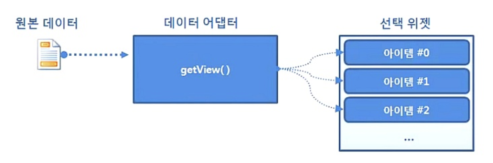
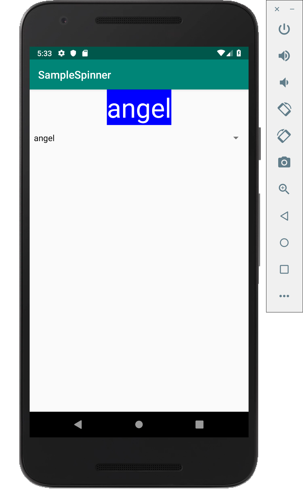
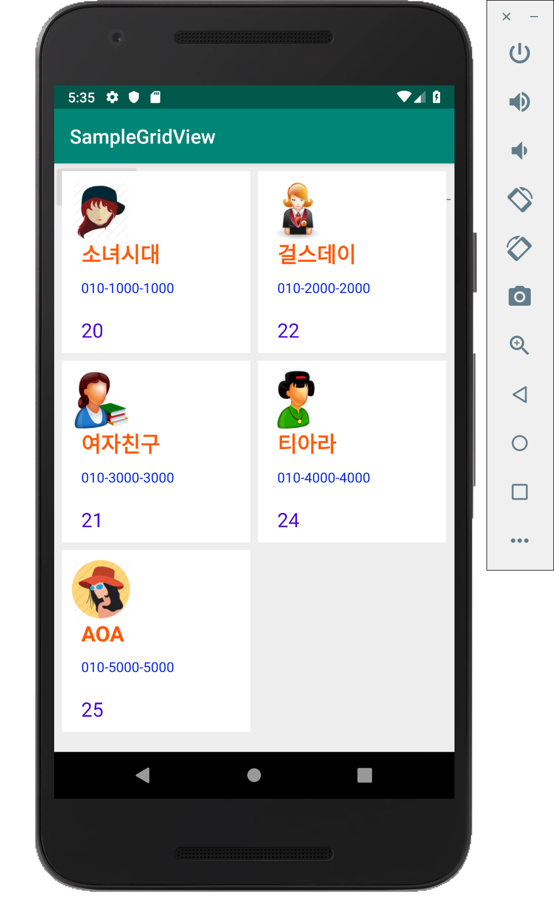
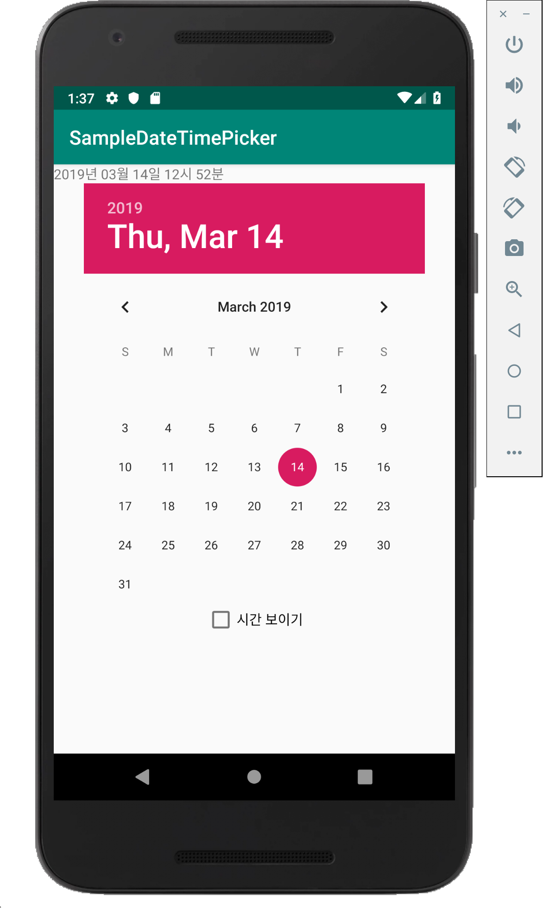
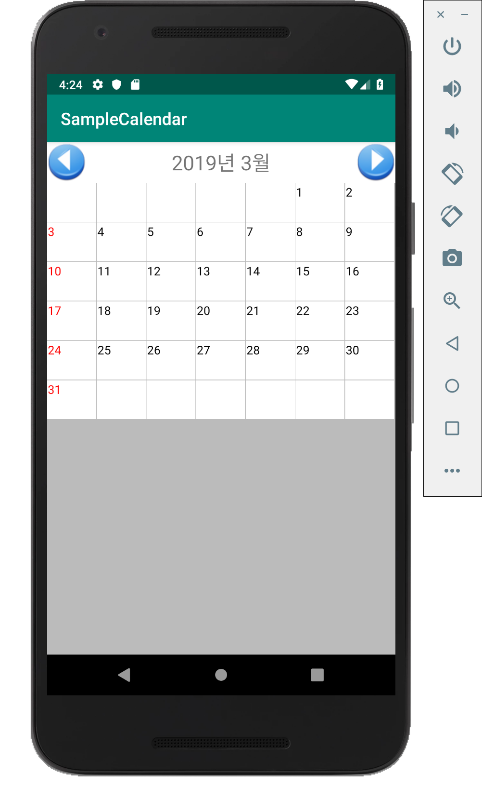
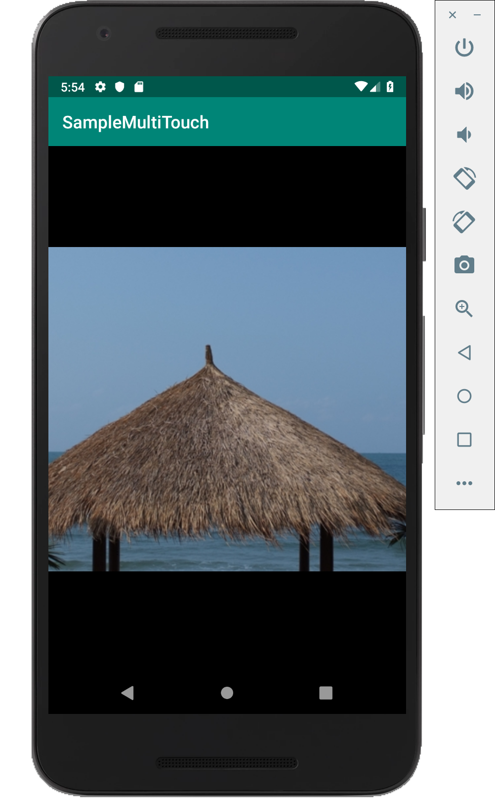

# 05-1. 나인패치 이미지 알아보기

* **나인패치(Nine Patch)** : 이미지가 늘어나거나 줄어들 때 생기는 이미지 왜곡을 해결하는 방법
* 이미지를 수정할 때 파일 이름을 **XXX.9.png**처럼 파일 확장자 앞에 **'.9'**를 붙여주어야 한다. 그러면 안드로이드가 원본 이미지의 가로, 세로 끝부분의 픽셀들을 모두 나인패치 이미지의 정보를 담은 것으로 인식한다.


## 예제(나인패치 이미지를 화면에 표시하기)

* **/res/layout/activity_xml**

  ```xml
  <?xml version="1.0" encoding="utf-8"?>
  <android.support.constraint.ConstraintLayout xmlns:android="http://schemas.android.com/apk/res/android"
      xmlns:app="http://schemas.android.com/apk/res-auto"
      xmlns:tools="http://schemas.android.com/tools"
      android:layout_width="match_parent"
      android:layout_height="match_parent"
      tools:context=".MainActivity">
  
      <LinearLayout
          android:orientation="vertical"
          android:layout_width="match_parent"
          android:layout_height="match_parent">
  
          <Button
              android:text="Small"
              android:textColor="#ffffffff"
              android:background="@drawable/button_image_01"
              android:layout_width="wrap_content"
              android:layout_height="wrap_content" />
  
          <Button
              android:background="@drawable/button_image_01"
              android:textColor="#ffffffff"
              android:text="MediumMediumMedium"
              android:layout_width="wrap_content"
              android:layout_height="wrap_content" />
  
          <Button
              android:text="LongLongLongLongLongLongLongLong"
              android:textColor="#ffffffff"
              android:background="@drawable/button_image_01"
              android:layout_width="wrap_content"
              android:layout_height="wrap_content" />
  
          <Button
              android:text="Small"
              android:background="@drawable/button_image_02"
              android:textColor="#ffffffff"
              android:layout_width="wrap_content"
              android:layout_height="wrap_content" />
  
          <Button
              android:text="MediumMediumMedium"
              android:textColor="#ffffffff"
              android:background="@drawable/button_image_02"
              android:layout_width="wrap_content"
              android:layout_height="wrap_content" />
  
          <Button
              android:background="@drawable/button_image_02"
              android:textColor="#ffffffff"
              android:text="LongLongLongLongLongLongLongLong"
              android:layout_width="wrap_content"
              android:layout_height="wrap_content" />
  
      </LinearLayout>
  
  </android.support.constraint.ConstraintLayout>
  ```

* **실행 결과**

  

  > 위의 세개 버튼은 button_image01.png 를 가져온 것이며 이미지가 왜곡되어 보이는 것을 확인할 수 있다. 하지만 밑의 세개 버튼은 **button_image02.9.png** 를 가져온 것으로 이미지가 왜곡되지 않고 그대로 유지되는 효과를 확인할 수 있다.

* **뷰의 배경으로 색상과 이미지를 지정하는 자바 코드 메소드들**

  ```java
  void setBackgroundColor (int color);
  void setBackgroundDrawable (Drawable d);
  void setBackgroundResource (int resid);
  ```


# 05-2. [비트맵] 버튼 만들기

* **[비트맵] 버튼(Bitmap Button)** : 그래픽 이미지로 구성된 버튼

  * **비트맵(Bitmap)** : 메모리 상에 만들어진 이미지

  * 비트맵 이미지를 이용할려면 버튼이 눌렸을 때와 떼어졌을 때의 이벤트를 구분하여 처리해야 한다.

  * 여러 앱에서 재사용하기 위해서는 버튼 클래스로 부터 상속받아(**뷰를 상속하여 새로운 뷰를 만든다.**) 새로운 클래스로 정의해야 한다.

  * **뷰에 관한 메소드들**

    ```java
    // 뷰가 스스로의 크기를 정할 때 호출되는 메소드
    // widthMeasureSpec과 heightMeasureSpec은 부모 컨테이너에서 이 뷰에게 허용하는
    // 여유 공간의 폭과 높이에 대한 정보이다.
    public void onMeasure (int widthMeasureSpec, int heightMeasureSpec);
    
    // 부모 컨테이너로 크기값을 리턴하고 싶을 때 사용하는 메소드
    // 이 메소드의 두 파라미터는 뷰의 폭과 높이이다.
    void setMeasuredDimension (int measuredWidth, int measuredHeight);
    
    // 스스로를 레이아웃에 맞게 그릴 때 호출되는 메소드
    public void onDraw(Canvas canvas);
    ```

* **뷰 위에 그래픽을 그리는 과정**

  

  > 1. 뷰가 화면 상에 보일 때는 **onDraw()** 메소드 호출. 이 메소드를 재정의 하면 내가 보여주고자 하는 내용물을 버튼 위에 그릴 수 있다.
  > 2. 버튼이나 무엇을 터치 후 옮겼을 때 이미지 또는 그래픽을 다시 그려야 할 필요가 있는데 이때는 **invalidate()** 메소드 호출. 이 메소드가 호출되면 onDraw() 메소드가 다시 호출된다.


## 예제(비트맵 버튼을 직접 만들어보기)

* **/res/values/dimens.xml**

  ```xml
  <?xml version="1.0" encoding="utf-8"?>
  <resources>
      <dimen name="text_size">16dp</dimen>
  </resources>
  
  ```

* **/java/com~/BitmapButton.java**

  ```java
  package com.example.samplebitmapwidget;
  
  import android.content.Context;
  import android.graphics.Color;
  import android.graphics.Typeface;
  import android.support.v7.widget.AppCompatButton;
  import android.util.AttributeSet;
  import android.view.MotionEvent;
  
  import static android.provider.ContactsContract.ProviderStatus.STATUS_NORMAL;
  
  // AppCompatButton 클래스를 상속하여 새로운 클래스 정의
  // 버튼의 기능을 그대로 유지한 채 어떤 기능을 추가하고 싶을 때
  
  public class BitmapButton extends AppCompatButton {
  
      // 아이콘 리소스 정의
      int iconNormal = R.drawable.bitmap_button_normal;
      int iconClicked = R.drawable.bitmap_button_clicked;
  
      // 아이콘 상태 정의
      int iconStatus = STATUS_NORMAL;
      public static int STATUS_NORMAL = 0;
      public static int STATUS_CLICKED = 1;
  
      // 소스 코드에서 객체를 생성했을 때 호출되는 생성자
      public BitmapButton(Context context) {
          super(context);
  
          init();
      }
  
      // XML 에 추가된 버튼이 인플레이션될 때 호출되는 생성자
      public BitmapButton(Context context, AttributeSet atts) {
          super(context, atts);
  
          init();
      }
  
      // 초기화 - 텍스트 크기는 /res/values/dimens.xml 에 정의한 값을 참조함.
      // 배경 이미지와 폰트의 크기, 색상, 글꼴을 설정한다.
      public void init() {
          // 배경 이미지 설정
          setBackgroundResource(iconNormal);
  
          int defaultTextColor = Color.WHITE;
          float defaultTextSize = getResources().getDimension(R.dimen.text_size);
          Typeface defaultTypeface = Typeface.DEFAULT_BOLD;
  
          // 글자 색상 설정
          setTextColor(defaultTextColor);
          // 글자 크기 설정
          setTextSize(defaultTextSize);
          // 글자의 폰트 설정
          setTypeface(defaultTypeface);
      }
  
      // 아이콘 리소스 설정
      public void setIcon(int iconNormal, int iconClicked) {
          this.iconNormal = iconNormal;
          this.iconClicked = iconClicked;
      }
  
      public boolean onTouchEvent(MotionEvent event) {
          super.onTouchEvent(event);
  
          int action = event.getAction();
  
          switch (action) {
              // 버튼을 눌렀을 때는 iconClicked 변수에 할당된 이미지 설정
              case MotionEvent.ACTION_DOWN :
                  setBackgroundResource(this.iconClicked);
  
                  iconStatus = STATUS_CLICKED;
  
                  break;
  
              case MotionEvent.ACTION_OUTSIDE :
              case MotionEvent.ACTION_CANCEL :
              case MotionEvent.ACTION_UP :
                  setBackgroundResource(this.iconNormal);
  
                  iconStatus = STATUS_NORMAL;
  
                  break;
          }
  
          invalidate();
  
          return true;
      }
  }
  ```

* **/res/layout/activity_main.xml**

  ```xml
  <?xml version="1.0" encoding="utf-8"?>
  <RelativeLayout xmlns:android="http://schemas.android.com/apk/res/android"
      xmlns:app="http://schemas.android.com/apk/res-auto"
      xmlns:tools="http://schemas.android.com/tools"
      android:layout_width="match_parent"
      android:layout_height="match_parent"
      tools:context=".MainActivity">
  
      <com.example.samplebitmapwidget.BitmapButton
          android:id="@+id/button"
          android:layout_centerInParent="true"
          android:text="시작하기"
          android:layout_width="200dp"
          android:layout_height="80dp" />
  
  </RelativeLayout>
  ```

* **실행 결과**

  


# 05-3. 리스트뷰 사용하기

* **리스트뷰** : 일반적으로 리스트 형태로 된 화면 컨트롤

* **선택 위젯(Selection Widget)** : 여러 개의 아이템 중에 하나를 선택할 수 있는 위젯들

* **선택 위젯과 어뎁터**

  : 원본 데이터를 위젯에 직접 설정하지 않고 어댑터라는 클래스를 사용. 선택할 수 있는 여러 개의 아이템이 표시되는 선택 위젯은 어댑터(Adapter)를 통해 각각의 아이템을 화면에 디스플레이한다. 그리고 어댑터가 데이터 관리 기능을 담당한다.

  

  > **getView() 메소드** : 이 메소드에서 리턴하는 뷰가 하나의 아이템으로 디스플레이된다.

* **하나의 아이템에 여러 정보를 담아 리스트뷰로 보여줄 때 해야 할 일들**

  | 속성                                | 설명                                                         |
  | ----------------------------------- | ------------------------------------------------------------ |
  | 아이템을 위한 XML 레이아웃 정의하기 | 리스트뷰에 들어갈 각 아이템의 레이아웃을 XML로 정의한다.     |
  | 아이템을 위한 뷰 정의하기           | 리스트뷰에 들어갈 각 아이템을 하나의 뷰로 정의한다. 이 뷰는 여러 개의 뷰를 담고 있는 뷰그룹이어야 합니다. |
  | 어댑터 정의하기                     | 데이터 관리 역할을 하는 어댑터 클래스를 만들고 그 안에 각 아이템으로 표시할 뷰를 반환하는 getView() 메소드를 정의합니다. |
  | 리스트뷰 다루기                     | 화면에 리스트뷰를 추가하고 아이템이 선택되었을 때 호출될 리스너 객체를 정의합니다. |


## 예제(아이템을 위한 XML 레이아웃 정의하기)

* **/res/layout/singer_item.xml**

  ```xml
  <?xml version="1.0" encoding="utf-8"?>
  <LinearLayout xmlns:android="http://schemas.android.com/apk/res/android"
      android:layout_width="match_parent"
      android:layout_height="wrap_content"
      android:orientation="horizontal">
  
      <!-- 왼쪽에 보이는 이미지 뷰 정의 -->
      <ImageView
          android:id="@+id/imageView"
          android:layout_width="80dp"
          android:layout_height="80dp"
          android:src="@drawable/singer" />
  
      <LinearLayout
          android:layout_width="match_parent"
          android:layout_height="wrap_content"
          android:layout_marginLeft="10dp"
          android:orientation="vertical">
  
          <!-- 첫 번째 줄의 텍스트뷰 정의 -->
          <TextView
              android:id="@+id/textView"
              android:layout_width="wrap_content"
              android:layout_height="wrap_content"
              android:text="New Text"
              android:textColor="#ff5805"
              android:textSize="40dp"
              android:textStyle="bold" />
  
  
          <!-- 두 번째 줄을 표시할 상대 레이아웃 정의 -->
          <RelativeLayout
              android:layout_width="match_parent"
              android:layout_height="wrap_content">
  
              <!-- 두 번째 줄의 왼쪽에 있는 텍스트뷰 정의 -->
              <TextView
                  android:id="@+id/textView2"
                  android:layout_width="wrap_content"
                  android:layout_height="wrap_content"
                  android:layout_alignParentLeft="true"
                  android:layout_marginTop="6dp"
                  android:text="New Text"
                  android:textColor="#0223e0"
                  android:textSize="20dp" />
  
              <!-- 두 번째 줄의 오른쪽에 있는 텍스트뷰 정의 -->
              <TextView
                  android:id="@+id/textView3"
                  android:layout_width="wrap_content"
                  android:layout_height="wrap_content"
                  android:layout_alignParentRight="true"
                  android:text="New Text"
                  android:textColor="#4902d6"
                  android:textSize="20dp" />
  
          </RelativeLayout>
      </LinearLayout>
  
  </LinearLayout>
  ```

* **/java/com~/SingerItemView.java**

  ```java
  package com.example.samplelistview;
  
  import android.content.Context;
  import android.view.LayoutInflater;
  import android.widget.ImageView;
  import android.widget.LinearLayout;
  import android.widget.TextView;
  
  // SingerItemVIew 클래스는 리니어 레이아웃을 상속하므로 다른 뷰들을 포함할 수 있다.
  public class SingerItemView extends LinearLayout {
      TextView textView;
      TextView textView2;
      TextView textView3;
      ImageView imageView;
  
      // Context 객체와 SingerItemView 객체를 파라미터로 전달받는다.
      public SingerItemView(Context context) {
          super(context);
          init(context);
      }
  
      public void init(Context context) {
          // XML 레이아웃의 정보를 객체화하기 위해 LayoutInflator 객체를 참조
          LayoutInflater inflater = (LayoutInflater)
                  context.getSystemService(context.LAYOUT_INFLATER_SERVICE);
          // 인플레이트
          inflater.inflate(R.layout.singer_item, this, true);
  
          textView = findViewById(R.id.textView);
          textView2 = findViewById(R.id.textView2);
          textView3 = findViewById(R.id.textView3);
          imageView = findViewById(R.id.imageView);
      }
  
      public void setName(String name) {
          textView.setText(name);
      }
  
      public void setMobile(String mobile) {
          textView2.setText(mobile);
      }
  
      public void setAge(int age) {
          textView3.setText(String.valueOf(age));
      }
  
      public void setImageView(int resId) {
          imageView.setImageResource(resId);
      }
  }
  ```

* **/java/com~/SingerItem.java**

  ```java
  package com.example.samplelistview;
  
  // 한 아이템에 필요한 데이터는 하나의 객체로 만들어 놓는 것이 좋으므로
  // 클래스로 정의한다.
  public class SingerItem {
  
      String name;
      String mobile;
      int age;
      int resId;
  
      public SingerItem(String name, String mobile) {
          this.name = name;
          this.mobile = mobile;
      }
  
      public SingerItem(String name, String mobile, int age, int resId) {
          this.name = name;
          this.mobile = mobile;
          this.age = age;
          this.resId = resId;
      }
  
      public String getName() {
          return name;
      }
  
      public void setName(String name) {
          this.name = name;
      }
  
      public String getMobile() {
          return mobile;
      }
  
      public void setMobile(String mobile) {
          this.mobile = mobile;
      }
  
      public int getAge() {
          return age;
      }
  
      public void setAge(int age) {
          this.age = age;
      }
  
      public int getResId() {
          return resId;
      }
  
      public void setResId(int resId) {
          this.resId = resId;
      }
  }
  ```

* **/java/com~/MainActivity.java**

  ```java
  package com.example.samplelistview;
  
  import android.support.v7.app.AppCompatActivity;
  import android.os.Bundle;
  import android.view.View;
  import android.view.ViewGroup;
  import android.widget.AdapterView;
  import android.widget.BaseAdapter;
  import android.widget.EditText;
  import android.widget.ListView;
  import android.widget.Toast;
  
  import java.util.ArrayList;
  
  public class MainActivity extends AppCompatActivity {
  
      EditText editText;
  
      ListView listView;
      SingerAdapter adapter;
  
      @Override
      protected void onCreate(Bundle savedInstanceState) {
          super.onCreate(savedInstanceState);
          setContentView(R.layout.activity_main);
  
          // 리스트뷰 객체 참조
          listView = findViewById(R.id.listView);
  
          // 어댑터 객체 참조
          adapter = new SingerAdapter();
  
          // 어댑터에 각 아이템의 데이터 추가
          adapter.addItem(new SingerItem("소녀시대", "010-1000-1000", 20, R.drawable.singer));
          adapter.addItem(new SingerItem("걸스데이", "010-2000-2000", 22, R.drawable.singer2));
          adapter.addItem(new SingerItem("여자친구", "010-3000-3000", 21, R.drawable.singer3));
          adapter.addItem(new SingerItem("티아라", "010-4000-4000", 24, R.drawable.singer4));
          adapter.addItem(new SingerItem("AOA", "010-5000-5000", 25, R.drawable.singer5));
  
          // 리스트뷰에 어댑터 객체 설정
          listView.setAdapter(adapter);
  
          // 아이템을 클릭했을 때 토스트 메시지를 보여주도록 리스너 설정
          listView.setOnItemClickListener(new AdapterView.OnItemClickListener() {
              @Override
              public void onItemClick(AdapterView<?> parent, View view, int position, long id) {
                  SingerItem item = (SingerItem) adapter.getItem(position);
                  Toast.makeText(getApplicationContext(), "선택 : " + item.getName(), Toast.LENGTH_LONG).show();
              }
          });
      }
  
      // BaseAdapter 를 상속하여 새로운 어댑터 클래스 정의
      class SingerAdapter extends BaseAdapter {
          // 각 아이템의 데이터를 담고 있는 SingerItem 객체를
          // 저장할 ArrayList 객체 생성
          ArrayList<SingerItem> items = new ArrayList<SingerItem>();
  
          @Override
          // 전체 아이템의 개수를 리턴하는 메소드 정의
          // (어댑터에서 관리하는 아이템의 개수를 리턴)
          public int getCount() {
              return items.size();
          }
  
          public void addItem(SingerItem item) {
              items.add(item);
          }
  
          @Override
          public Object getItem(int position) {
              return items.get(position);
          }
  
          @Override
          public long getItemId(int position) {
              return position;
          }
  
          @Override
          // 아이템에 표시할 뷰 리턴하는 메소드 정의
          // 첫 번째 파라미터 : 아이템의 인덱스, 리스트 뷰에서 아이템의 위치
          // 두 번째 파라미터 : 현재 인덱스에 해당하는 뷰 객체
          // 세 번째 파라미터 : 이 뷰를 포함하고 있는 부모 컨테이너 객체.
          public View getView(int position, View convertView, ViewGroup viewGroup) {
              SingerItemView view = new SingerItemView(getApplicationContext());
              SingerItem item = items.get(position);
              view.setName(item.getName());
              view.setMobile(item.getMobile());
              view.setAge(item.getAge());
              view.setImageView(item.getResId());
  
              return view;
          }
      }
  }
  ```

* **/res/layout/activity_main.xml**

  ```xml
  <?xml version="1.0" encoding="utf-8"?>
  <android.support.constraint.ConstraintLayout xmlns:android="http://schemas.android.com/apk/res/android"
      xmlns:app="http://schemas.android.com/apk/res-auto"
      xmlns:tools="http://schemas.android.com/tools"
      android:layout_width="match_parent"
      android:layout_height="match_parent"
      tools:context=".MainActivity">
  
      <LinearLayout
          android:orientation="vertical"
          android:layout_width="match_parent"
          android:layout_height="match_parent">
  
          <ListView
              android:id="@+id/listView"
              android:layout_width="match_parent"
              android:layout_height="match_parent">
  
          </ListView>
  
      </LinearLayout>
  
  </android.support.constraint.ConstraintLayout>
  ```

* **실행 결과**

  

# 05-4. 스피너 사용하기

* **스피너(Spinner)** : 리스트뷰처럼 여러 아이템 중에서 하나를 선택하는 전형적인 위젯.


## 예제(스피너 사용하기)

* **/res/layout/activity_main.xml**

  ```xml
  <?xml version="1.0" encoding="utf-8"?>
  <android.support.constraint.ConstraintLayout xmlns:android="http://schemas.android.com/apk/res/android"
      xmlns:app="http://schemas.android.com/apk/res-auto"
      xmlns:tools="http://schemas.android.com/tools"
      android:layout_width="match_parent"
      android:layout_height="match_parent"
      tools:context=".MainActivity">
  
      <LinearLayout
          android:orientation="vertical"
          android:layout_width="match_parent"
          android:layout_height="match_parent">
  
          <!-- 선택된 아이템이 무엇인지 표시할 텍스트뷰 정의 -->
          <TextView
              android:id="@+id/textView"
              android:background="#0000ff"
              android:textColor="#ffffff"
              android:textSize="50dp"
              android:layout_gravity="center_horizontal"
              android:layout_height="wrap_content"
              android:layout_width="wrap_content"
              />
  
          <!-- 스피너 정의 -->
          <Spinner
              android:id="@+id/spinner"
              android:layout_width="match_parent"
              android:layout_height="wrap_content">
          </Spinner>
  
      </LinearLayout>
  
  </android.support.constraint.ConstraintLayout>
  ```

* **/java/com~/MainActivity.java**

  ```java
  package com.example.samplespinner;
  
  import android.support.v7.app.AppCompatActivity;
  import android.os.Bundle;
  import android.view.View;
  import android.widget.AdapterView;
  import android.widget.ArrayAdapter;
  import android.widget.Spinner;
  import android.widget.TextView;
  
  public class MainActivity extends AppCompatActivity {
  
      TextView textView;
  
      String[] items = { "mike", "angel", "crow", "john", "ginnie", "sally", "cohen", "rice" };
  
      @Override
      protected void onCreate(Bundle savedInstanceState) {
          super.onCreate(savedInstanceState);
          setContentView(R.layout.activity_main);
  
          // 텍스트뷰 객체 참조
          textView = findViewById(R.id.textView);
  
          // 스피너 객체 참조
          Spinner spinner = findViewById(R.id.spinner);
  
          // 문자열 배열을 어댑터로 매핑
          // 첫 번째 파라미터 : Context 객체
          // 두 번째 파라미터 : 뷰를 초기화할 때 사용하는 XML
          // (android.R.layout.simple_spinner_dropdown_item : 안드로이드 API에 들어 있는 미리 정의된 레이아웃, 단순 스피너 아이템의 레이아웃)
          // 세 번째 파라미터 : 아이템으로 보일 문자열 데이터들의 배열
          ArrayAdapter<String> adapter = new ArrayAdapter<String>(
                  this, android.R.layout.simple_spinner_dropdown_item, items);
  
          // 문자열로만 구성된 아이템들을 스피너로 보여주기 위한 메소드
          // 스피너의 각 아이템들을 보여줄 뷰에 사용되는 레이아웃을 지정
          adapter.setDropDownViewResource(
                  android.R.layout.simple_spinner_dropdown_item
          );
  
          // 스피너 객체를 어댑터의 객체로 전달
          spinner.setAdapter(adapter);
  
          // 아이템 선택 이벤트 처리
          // 스피너 객체가 아이템 선택 이벤트를 처리할 수 있도록 하는 리스너
          spinner.setOnItemSelectedListener(new AdapterView.OnItemSelectedListener() {
  
              // 아이템이 선택되었을 때 호출됨
              @Override
              public void onItemSelected(AdapterView<?> parent, View view, int position, long id) {
                  textView.setText(items[position]);
              }
  
              // 아무것도 선택되지 않았을 때 호출됨
              @Override
              public void onNothingSelected(AdapterView<?> parent) {
                  textView.setText("");
              }
          });
      }
  }
  ```

* **실행 결과**

  


## 예제(하나의 문자열을 하나의 아이템으로 보여주기)

* **java/com~/MainActivity.java(프로젝트 안만들었음)**

  ```java
  public class MainActivity extends ListActivity {
      ...
      // 리스트에 표시될 아이템들의 데이터를 배열로 정의
      String[] items = {
          "mike", "angel", "crow", "john", "ginnie", "sally", "cohen", "rice"
      };
      
      // ArrayAdapter를 이용해 어댑터 객체를 생성한 후 리스트에 설정
      public void onCreate(Bundle savedInstanceState) {
          ...
          setListAdapter(new ArrayAdapter<String>(
          	this,
              android.R.layout.simple_list_item_1,
              items
              )
          );
          ...
          
          // 리스트의 아이템이 선택되었을 때 처리하는 메소드 정의
          protected void onListItemClick(ListView l, View v, int position, long id) {
              super.onListItemClick(l, v, position, id);
              
              String text = " position: " + position + " " + items[position];
          }
      }
  }
  ```


# 05-5. 그리드뷰 사용하기

* **그리드뷰(GridView)** : 화면이 큰 PC 또는 웹에서 자주 사용하는 테이블(Table) 형태와 유사하게 데이터를 보여준다.
* 격자 모양으로 보여주는 그리드뷰도 **여러 아이템 중의 하나를 선택하는 특징**이 있어 **선택 위젯**으로 분류한다. 그러므로 **어댑터**를 이용해 뷰에 들어가는 데이터를 설정하고 **getView() 메소드**를 이용해 각 아이템이 표현되는 모양을 결정한다.
* **주의할 점** : 그리드뷰는 2차원적인 데이터, 즉 행과 열이 있는 데이터이기 때문에 정확하게 위치를 설정해줘야 한다.


## 예제(그리드뷰 사용)

* **/res/layout/activity_main.xml**

  ```xml
  <?xml version="1.0" encoding="utf-8"?>
  <RelativeLayout
      xmlns:android="http://schemas.android.com/apk/res/android"
      xmlns:app="http://schemas.android.com/apk/res-auto"
      xmlns:tools="http://schemas.android.com/tools"
      android:layout_width="match_parent"
      android:layout_height="match_parent"
      android:background="#ffeeeeee"
      tools:context=".MainActivity">
  
      <LinearLayout
          android:id="@+id/layout1"
          android:orientation="horizontal"
          android:layout_width="match_parent"
          android:layout_height="wrap_content">
  
          <Button
              android:text="추가"
              android:id="@+id/button"
              android:layout_width="wrap_content"
              android:layout_height="wrap_content" />
  
          <EditText
              android:id="@+id/editText"
              android:hint="name"
              android:layout_width="match_parent"
              android:layout_height="wrap_content" />
  
      </LinearLayout>
  
      <!-- numColumns 속성 : 그리드뷰의 칼럼 수를 설정하는 역할, 그리드뷰를 구분 짓는 가장 중요한 속성이다. -->
      <!-- horizontalSpacing, verticalSpacing 속성 : 각 아이템의 간격 -->
      <GridView
          android:id="@+id/gridView"
          android:layout_alignParentStart="true"
          android:layout_alignParentLeft="true"
          android:layout_width="match_parent"
          android:layout_height="match_parent"
          android:background="#ffeeeeee"
          android:numColumns="2"
          android:horizontalSpacing="8dp"
          android:verticalSpacing="8dp"
          android:layout_margin="8dp"
          >
  
      </GridView>
  
  </RelativeLayout>
  ```

* **/java/com~/SingerItem.java**

  ```java
  package com.example.samplegridview;
  
  // 한 아이템에 필요한 데이터는 하나의 객체로 만들어 놓는 것이 좋으므로
  // 클래스로 정의한다.
  public class SingerItem {
  
      String name;
      String mobile;
      int age;
      int resId;
  
      public SingerItem(String name, String mobile) {
          this.name = name;
          this.mobile = mobile;
      }
  
      public SingerItem(String name, String mobile, int age, int resId) {
          this.name = name;
          this.mobile = mobile;
          this.age = age;
          this.resId = resId;
      }
  
      public String getName() {
          return name;
      }
  
      public void setName(String name) {
          this.name = name;
      }
  
      public String getMobile() {
          return mobile;
      }
  
      public void setMobile(String mobile) {
          this.mobile = mobile;
      }
  
      public int getAge() {
          return age;
      }
  
      public void setAge(int age) {
          this.age = age;
      }
  
      public int getResId() {
          return resId;
      }
  
      public void setResId(int resId) {
          this.resId = resId;
      }
  }
  
  ```

* **/java/com~/SingerItemView.java**

  ```java
  package com.example.samplegridview;
  
  import android.content.Context;
  import android.view.LayoutInflater;
  import android.widget.ImageView;
  import android.widget.LinearLayout;
  import android.widget.TextView;
  
  // SingerItemVIew 클래스는 리니어 레이아웃을 상속하므로 다른 뷰들을 포함할 수 있다.
  public class SingerItemView extends LinearLayout {
      TextView textView;
      TextView textView2;
      TextView textView3;
      ImageView imageView;
  
      // Context 객체와 SingerItemView 객체를 파라미터로 전달받는다.
      public SingerItemView(Context context) {
          super(context);
          init(context);
      }
  
      public void init(Context context) {
          // XML 레이아웃의 정보를 객체화하기 위해 LayoutInflator 객체를 참조
          LayoutInflater inflater = (LayoutInflater)
                  context.getSystemService(context.LAYOUT_INFLATER_SERVICE);
          // 인플레이트
          inflater.inflate(R.layout.singer_item, this, true);
  
          textView = findViewById(R.id.textView);
          textView2 = findViewById(R.id.textView2);
          textView3 = findViewById(R.id.textView3);
          imageView = findViewById(R.id.imageView);
      }
  
      public void setName(String name) {
          textView.setText(name);
      }
  
      public void setMobile(String mobile) {
          textView2.setText(mobile);
      }
  
      public void setAge(int age) {
          textView3.setText(String.valueOf(age));
      }
  
      public void setImageView(int resId) {
          imageView.setImageResource(resId);
      }
  }
  ```

* **/java/com~/MainActivity.java**

  ```java
  package com.example.samplegridview;
  
  import android.support.v7.app.AppCompatActivity;
  import android.os.Bundle;
  import android.view.View;
  import android.view.ViewGroup;
  import android.widget.AdapterView;
  import android.widget.BaseAdapter;
  import android.widget.EditText;
  import android.widget.GridView;
  import android.widget.Toast;
  
  import java.util.ArrayList;
  
  public class MainActivity extends AppCompatActivity {
  
      EditText editText;
  
      GridView gridView;
      SingerAdapter adapter;
  
      @Override
      protected void onCreate(Bundle savedInstanceState) {
          super.onCreate(savedInstanceState);
          setContentView(R.layout.activity_main);
  
          gridView = findViewById(R.id.gridView);
  
          // 어댑터 객체 참조
          adapter = new SingerAdapter();
  
          // 어댑터에 각 아이템의 데이터 추가
          adapter.addItem(new SingerItem("소녀시대", "010-1000-1000", 20, R.drawable.singer));
          adapter.addItem(new SingerItem("걸스데이", "010-2000-2000", 22, R.drawable.singer2));
          adapter.addItem(new SingerItem("여자친구", "010-3000-3000", 21, R.drawable.singer3));
          adapter.addItem(new SingerItem("티아라", "010-4000-4000", 24, R.drawable.singer4));
          adapter.addItem(new SingerItem("AOA", "010-5000-5000", 25, R.drawable.singer5));
  
          // 그리드뷰에 어댑터 객체 설정
          gridView.setAdapter(adapter);
  
          editText = findViewById(R.id.editText);
  
          // 그리드뷰의 아이템 선택 이벤트를 처리할 리스너 설정
          gridView.setOnItemClickListener(new AdapterView.OnItemClickListener() {
              @Override
              public void onItemClick(AdapterView<?> parent, View view, int position, long id) {
                  SingerItem item = (SingerItem) adapter.getItem(position);
                  Toast.makeText(getApplicationContext(), "선택 : " + item.getName(), Toast.LENGTH_LONG).show();
              }
          });
      }
  
      // BaseAdapter 를 상속하여 새로운 어댑터 클래스 정의
      class SingerAdapter extends BaseAdapter {
          // 각 아이템의 데이터를 담고 있는 SingerItem 객체를
          // 저장할 ArrayList 객체 생성
          ArrayList<SingerItem> items = new ArrayList<SingerItem>();
  
          @Override
          // 전체 아이템의 개수를 리턴하는 메소드 정의
          // (어댑터에서 관리하는 아이템의 개수를 리턴)
          public int getCount() {
              return items.size();
          }
  
          public void addItem(SingerItem item) {
              items.add(item);
          }
  
          @Override
          public Object getItem(int position) {
              return items.get(position);
          }
  
          @Override
          public long getItemId(int position) {
              return position;
          }
  
          @Override
          // 아이템에 표시할 뷰 리턴하는 메소드 정의
          // 첫 번째 파라미터 : 아이템의 인덱스, 리스트 뷰에서 아이템의 위치
          // 두 번째 파라미터 : 현재 인덱스에 해당하는 뷰 객체
          // 세 번째 파라미터 : 이 뷰를 포함하고 있는 부모 컨테이너 객체.
          public View getView(int position, View convertView, ViewGroup viewGroup) {
              SingerItemView view = new SingerItemView(getApplicationContext());
              SingerItem item = items.get(position);
              view.setName(item.getName());
              view.setMobile(item.getMobile());
              view.setAge(item.getAge());
              view.setImageView(item.getResId());
  
              return view;
          }
      }
  }
  ```

* **/res/layout/singer_item.xml**

  ```xml
  <?xml version="1.0" encoding="utf-8"?>
  <LinearLayout xmlns:android="http://schemas.android.com/apk/res/android"
      android:padding="10dp"
      android:background="#ffffffff"
      android:layout_width="match_parent"
      android:layout_height="wrap_content"
      android:orientation="vertical">
  
      <ImageView
          android:id="@+id/imageView"
          android:src="@drawable/singer"
          android:layout_width="60dp"
          android:layout_height="60dp" />
  
      <LinearLayout
          android:layout_marginLeft="10dp"
          android:orientation="vertical"
          android:layout_width="match_parent"
          android:layout_height="wrap_content">
  
          <TextView
              android:id="@+id/textView"
              android:text="New Text"
              android:textColor="#ff5805"
              android:textSize="22dp"
              android:textStyle="bold"
              android:layout_width="wrap_content"
              android:layout_height="wrap_content" />
  
          <TextView
              android:id="@+id/textView2"
              android:layout_marginTop="10dp"
              android:text="New Text"
              android:textColor="#0223e0"
              android:textSize="14dp"
              android:layout_width="wrap_content"
              android:layout_height="wrap_content" />
  
          <TextView
              android:id="@+id/textView3"
              android:layout_marginTop="20dp"
              android:text="New Text"
              android:textSize="20dp"
              android:textColor="#4902d6"
              android:layout_width="wrap_content"
              android:layout_height="wrap_content" />
  
      </LinearLayout>
  
  </LinearLayout>
  ```

* **실행 결과**

  


# 05-6. 복합 위젯 만들기

* 뷰를 상속해서 새로운 뷰를 만드는 것은 커스텀뷰를 만드는 가장 전형적인 방법이다.
* **복합 위젯(Composite Widget)** : 하나 이상의 뷰를 포함하고 있는 위젯으로 여러 개의 뷰를 하나의 클래스로 정의하여 재사용성을 높이기 위해 만든 위젯을 말한다.


## 예제(달력과 시계 위젯 사용)

* **/res/layout/picker.xml**

  ```xml
  <?xml version="1.0" encoding="utf-8"?>
  <LinearLayout
      xmlns:android="http://schemas.android.com/apk/res/android"
      android:gravity="center"
      android:orientation="vertical"
      android:layout_width="wrap_content"
      android:layout_height="wrap_content">
  
      <!-- 날짜 선택 위젯 정의 -->
      <DatePicker
          android:id="@+id/datePicker"
          android:layout_width="wrap_content"
          android:layout_height="wrap_content">
      </DatePicker>
  
      <!-- 시간 선택 위젯을 보일지 여부를 결정하는 체크박스 정의 -->
      <CheckBox
          android:id="@+id/enableTimeCheckBox"
          android:text="시간 보이기"
          android:layout_width="wrap_content"
          android:layout_height="wrap_content" />
  
      <!-- 시간 선택 위젯 정의 -->
      <TimePicker
          android:id="@+id/timePicker"
          android:layout_width="wrap_content"
          android:layout_height="wrap_content">
      </TimePicker>
  
  </LinearLayout>
  ```

* **/java/com~/DateTimePicker.java**

  ```java
  package com.example.sampledatetimepicker;
  
  import android.content.Context;
  import android.support.annotation.Nullable;
  import android.util.AttributeSet;
  import android.view.LayoutInflater;
  import android.view.View;
  import android.widget.CheckBox;
  import android.widget.CompoundButton;
  import android.widget.DatePicker;
  import android.widget.LinearLayout;
  import android.widget.TimePicker;
  
  import java.util.Calendar;
  
  // 리니어 레이아웃을 상속하여 새로운 클래스 정의
  public class DateTimePicker extends LinearLayout {
      
      // 날짜나 시간이 변경되는 이벤트를 함께 처리하기 위한
      // 새로운 리스너 인터페이스 정의
      public static interface OnDateTimeChangedListener {
          void onDateTimeChanged(DateTimePicker view, int year, int monthOfYear,
                                 int dayOfYear, int hourOfDay, int minute);
      }
  
      private OnDateTimeChangedListener listener;
      private DatePicker datePicker;
      private TimePicker timePicker;
      private CheckBox enableTimeCheckBox;
  
      public DateTimePicker(Context context) {
          super(context);
          init(context);
      }
  
      public DateTimePicker(Context context, @Nullable AttributeSet attrs) {
          super(context, attrs);
          init(context);
      }
  
      private void init(Context context) {
          // 새로 정의한 클래스를 위한 레이아웃 인플레이션
          LayoutInflater inflater = (LayoutInflater)
                  context.getSystemService(Context.LAYOUT_INFLATER_SERVICE);
          inflater.inflate(R.layout.picker, this, true);
  
          // 시간 정보 참조
          Calendar calendar = Calendar.getInstance();
          final int curYear = calendar.get(Calendar.YEAR);
          final int curMonth = calendar.get(Calendar.MONTH);
          final int curDay = calendar.get(Calendar.DAY_OF_MONTH);
          final int curHour = calendar.get(Calendar.HOUR_OF_DAY);
          final int curMinute = calendar.get(Calendar.MINUTE);
  
          // 날짜 선택 위젯 초기화
          datePicker = findViewById(R.id.datePicker);
          datePicker.init(curYear, curMonth, curDay, new DatePicker.OnDateChangedListener() {
              @Override
              public void onDateChanged(DatePicker view, int year, int monthOfYear, int dayOfMonth) {
                  // 새로 정의한 리스너 이벤트 전달
                  if(listener != null) {
                      // 시간이 변경되는 이벤트가 발생했을 때
                      // 새로운 리스너의 메소드 호출
                      listener.onDateTimeChanged(
                              DateTimePicker.this, year, monthOfYear, dayOfMonth,
                              timePicker.getCurrentHour(), timePicker.getCurrentMinute()
                      );
                  }
              }
          });
  
          // 체크박스 이벤트 처리
          enableTimeCheckBox = findViewById(R.id.enableTimeCheckBox);
          enableTimeCheckBox.setOnCheckedChangeListener(new CompoundButton.OnCheckedChangeListener() {
              @Override
              public void onCheckedChanged(CompoundButton buttonView, boolean isChecked) {
                  timePicker.setEnabled(isChecked);
                  timePicker.setVisibility((enableTimeCheckBox).isChecked() ?
                          View.VISIBLE : View.INVISIBLE);
              }
          });
  
          // 시간 선택 위젯 이벤트 처리
          timePicker = findViewById(R.id.timePicker);
          timePicker.setOnTimeChangedListener(new TimePicker.OnTimeChangedListener() {
              @Override
              public void onTimeChanged(TimePicker view, int hourOfDay, int minute) {
                  if(listener != null) {
                      listener.onDateTimeChanged(
                              DateTimePicker.this, datePicker.getYear(),
                              datePicker.getMonth(), datePicker.getDayOfMonth(),
                              hourOfDay, minute
                      );
                  }
              }
          });
  
          timePicker.setCurrentHour(curHour);
          timePicker.setCurrentMinute(curMinute);
          timePicker.setEnabled(enableTimeCheckBox.isChecked());
          timePicker.setVisibility((enableTimeCheckBox.isChecked() ?
                  View.VISIBLE : View.INVISIBLE));
      }
  
      // 새로운 리스너 객체 설정 메소드 정의
      public void setOnDateTimeChangedListener(OnDateTimeChangedListener dateTimeListener) {
          this.listener = dateTimeListener;
      }
  
      public void updateDateTime(int year, int monthOfYear, int dayOfMonth,
                                 int currentHour, int currentMinute) {
          datePicker.updateDate(year, monthOfYear, dayOfMonth);
          timePicker.setCurrentHour(currentHour);
          timePicker.setCurrentMinute(currentMinute);
      }
  
      public void setIs24HourView(final boolean is24HourView) {
          timePicker.setIs24HourView(is24HourView);
      }
  
      public int getYear() {
          return datePicker.getYear();
      }
  
      public int getMonth() {
          return datePicker.getMonth();
      }
  
      public int getDayOfMonth() {
          return datePicker.getDayOfMonth();
      }
  
      public int getCurrentHour() {
          return timePicker.getCurrentHour();
      }
  
      public int getCurrentMinute() {
          return timePicker.getCurrentMinute();
      }
  
      public boolean enableTime() {
          return enableTimeCheckBox.isChecked();
      }
  
  }
  ```

* **/res/layout/activity_main.xml**

  ```xml
  <?xml version="1.0" encoding="utf-8"?>
  <android.support.constraint.ConstraintLayout xmlns:android="http://schemas.android.com/apk/res/android"
      xmlns:app="http://schemas.android.com/apk/res-auto"
      xmlns:tools="http://schemas.android.com/tools"
      android:layout_width="match_parent"
      android:layout_height="match_parent"
      tools:context=".MainActivity">
  
      <LinearLayout
          android:orientation="vertical"
          android:layout_width="match_parent"
          android:layout_height="match_parent">
  
          <!-- 변경된 날짜와 시간 값을 표시하는 텍스트뷰 추가 -->
          <TextView
              android:id="@+id/textView"
              android:layout_width="wrap_content"
              android:layout_height="wrap_content" />
  
          <!-- 새로 정의한 DateTimePicker 뷰 사용을 위해 추가 -->
          <com.example.sampledatetimepicker.DateTimePicker
              android:id="@+id/picker"
              android:layout_width="wrap_content"
              android:layout_height="wrap_content">
  
          </com.example.sampledatetimepicker.DateTimePicker>
  
      </LinearLayout>
  
  </android.support.constraint.ConstraintLayout>
  ```

* **/java/com~/MainActivity.java**

  ```java
  package com.example.sampledatetimepicker;
  
  import android.support.v7.app.AppCompatActivity;
  import android.os.Bundle;
  import android.widget.TextView;
  
  import java.text.SimpleDateFormat;
  import java.util.Calendar;
  
  public class /**/MainActivity extends AppCompatActivity {
  
      final SimpleDateFormat dateFormat = new SimpleDateFormat(
              "yyyy년 MM월 dd일 HH시 mm분"
      );
  
      TextView textView;
      DateTimePicker picker;
  
      @Override
      protected void onCreate(Bundle savedInstanceState) {
          super.onCreate(savedInstanceState);
          setContentView(R.layout.activity_main);
  
          textView = findViewById(R.id.textView);
          picker = (DateTimePicker) findViewById(R.id.picker);
  
          // 이벤트 처리
          picker.setOnDateTimeChangedListener(
                  new DateTimePicker.OnDateTimeChangedListener() {
                      @Override
                      public void onDateTimeChanged(DateTimePicker view, int year, int monthOfYear, int dayOfYear, int hourOfDay, int minute) {
                          Calendar calendar = Calendar.getInstance();
                          calendar.set(year, monthOfYear, dayOfYear, hourOfDay, minute);
  
                          // 바뀐 시간 텍스트뷰에 표시
                          textView.setText(dateFormat.format(calendar.getTime()));
                      }
                  }
          );
  
          Calendar calendar = Calendar.getInstance();
          calendar.set(picker.getYear(), picker.getMonth(), picker.getDayOfMonth(), picker.getCurrentHour(), picker.getCurrentMinute());
          textView.setText(dateFormat.format(calendar.getTime()));
      }
  }
  ```

* **실행 결과**

  


# 05-7. 월별 캘린더 만들기

: 월별 캘린더는 격자 모양일 수 밖에 없으므로 테이블 레이아웃이나 그리드뷰를 이용하는 것이 좋다. 그리드뷰를 이용하면 필요에 따라 데이터 캐싱을 통해 메모리 사용을 줄여준다.

## 예제

* **/res/layout/activity_main.xml**

  ```xml
  <?xml version="1.0" encoding="utf-8"?>
  <LinearLayout xmlns:android="http://schemas.android.com/apk/res/android"
      xmlns:app="http://schemas.android.com/apk/res-auto"
      xmlns:tools="http://schemas.android.com/tools"
      android:orientation="vertical"
      android:layout_width="match_parent"
      android:layout_height="match_parent"
      tools:context=".MainActivity">
  
      <RelativeLayout
          android:background="#ffffffff"
          android:layout_width="match_parent"
          android:layout_height="wrap_content">
  
          <!--이전 월로 이동하기 위한 버튼 추가-->
          <Button
              android:id="@+id/monthPrevious"
              android:layout_width="46dp"
              android:layout_height="wrap_content"
              android:background="@drawable/backward"
              android:gravity="center_horizontal"
              android:layout_alignParentLeft="true"
              />
  
          <!--현재 월을 표시하기 위한 텍스트뷰 추가-->
          <TextView
              android:id="@+id/monthText"
              android:layout_width="200dp"
              android:layout_height="wrap_content"
              android:text="MonthView"
              android:textSize="24dp"
              android:gravity="center_horizontal"
              android:layout_centerInParent="true"
              />
  
          <!--이후 월로 이동하기 위한 버튼 추가-->
          <Button
              android:id="@+id/monthNext"
              android:background="@drawable/forward"
              android:gravity="center_horizontal"
              android:layout_alignParentRight="true"
              android:layout_width="46dp"
              android:layout_height="wrap_content" />
      </RelativeLayout>
  
      <!--새로 정의한 월별 캘린더 뷰 추가-->
      <GridView
          android:id="@+id/monthView"
          android:numColumns="7"
          android:stretchMode="columnWidth"
          android:horizontalSpacing="1dp"
          android:verticalSpacing="1dp"
          android:background="#ffbbbbbb"
          android:layout_width="match_parent"
          android:layout_height="match_parent">
      </GridView>
  
  </LinearLayout>
  ```

* **/java/com~/MonthItem.java**

  ```java
  package com.example.samplecalendar;
  
  public class MonthItem {
  
      private int dayValue;
  
      public MonthItem(){}
  
      public MonthItem(int day) {
          dayValue = day;
      }
  
      public int getDay() {
          return dayValue;
      }
  
      public void setDay(int day) {
          this.dayValue = day;
      }
  }
  ```

* **/java/com~/MonthItemView.java**

  ```java
  package com.example.samplecalendar;
  
  import android.content.Context;
  import android.graphics.Color;
  import android.support.annotation.Nullable;
  import android.support.v7.widget.AppCompatTextView;
  import android.util.AttributeSet;
  
  public class MonthItemView extends AppCompatTextView {
  
      private MonthItem item;
  
      public MonthItemView(Context context) {
          super(context);
  
          init();
      }
  
      public MonthItemView(Context context,@Nullable AttributeSet attrs) {
          super(context, attrs);
  
          init();
      }
  
      private void init() {
          setBackgroundColor(Color.WHITE);
      }
  
      public MonthItem getItem() {
          return item;
      }
  
      public void setItem(MonthItem item) {
          this.item = item;
  
          int day = item.getDay();
          if (day != 0) {
              setText(String.valueOf(day));
          } else {
              setText("");
          }
      }
  }
  ```

* **/java/com~/MonthAdapter.java**

  ```java
  package com.example.samplecalendar;
  
  import android.content.Context;
  import android.graphics.Color;
  import android.support.annotation.Nullable;
  import android.text.format.Time;
  import android.util.AttributeSet;
  import android.util.Log;
  import android.view.Gravity;
  import android.view.View;
  import android.view.ViewGroup;
  import android.widget.AbsListView;
  import android.widget.BaseAdapter;
  import android.widget.GridView;
  
  import java.util.Calendar;
  
  // BaseAdapter 를 상속하여 새로운 어댑터 정의
  public class MonthAdapter extends BaseAdapter {
      // 태그 설정
      public static final String TAG = "MonthAdapter";
  
      Context mContext;
  
      public static int oddColor = Color.rgb(255, 255, 255);
      public static int headColor = Color.rgb(12, 32, 158);
  
      private int selectedPosition = -1;
  
      private MonthItem[] items;
  
      private int countColumn = 7;
  
      int mStartDay;
      int startDay;
      int curYear;
      int curMonth;
  
      int firstDay;
      int lastDay;
  
      Calendar mCalendar;
      boolean recreateItems = false;
  
  
      public MonthAdapter(Context context) {
          super();
  
          mContext = context;
  
          init();
      }
  
      public MonthAdapter(Context context, @Nullable AttributeSet attributeSet) {
          super();
  
          mContext = context;
  
          init();
      }
  
      // 1개월의 일별 데이터를 담고 있을 수 있는
      // MonthItem 의 배열 객체 생성
      private void init() {
          items = new MonthItem[7 * 6];
  
          mCalendar = Calendar.getInstance();
          recalculate();
          resetDayNumbers();
      }
  
      // 어댑터를 초기화할 때 호출
      // 월별로 시작하는 날짜를 계산
      public void recalculate() {
          mCalendar.set(Calendar.DAY_OF_MONTH, 1);
  
          int dayOfWeek = mCalendar.get(Calendar.DAY_OF_WEEK);
          firstDay = getFirstDay(dayOfWeek);
          Log.d(TAG, "firstDay : " + firstDay);
  
          mStartDay = mCalendar.getFirstDayOfWeek();
          curYear = mCalendar.get(Calendar.YEAR);
          curMonth = mCalendar.get(Calendar.MONTH);
          lastDay = getMonthLastDay(curYear, curMonth);
  
          Log.d(TAG, "curYear : " + curYear + ", curMonth : " + curMonth + ", lastDay : " + lastDay);
  
          int diff = mStartDay - Calendar.SUNDAY - 1;
          startDay = getFirstDayOfWeek();
          Log.d(TAG, "mStartDay : " + mStartDay + ", startDay : " + startDay);
      }
  
      // 이전 월로 이동 시 일별 데이터 새로 계산
      public void setPreviousMonth() {
          mCalendar.add(Calendar.MONTH, -1);
          recalculate();
  
          resetDayNumbers();
          selectedPosition = -1;
      }
  
      // 다음 월로 이동 시 일별 데이터 새로 계산
      public void setNextMonth() {
          mCalendar.add(Calendar.MONTH, 1);
          recalculate();
  
          resetDayNumbers();
          selectedPosition = -1;
      }
  
      // 어댑터를 초기화할 때 호출
      // 지정한 월의 일별 데이터를 새로 계산하는 메소드 정의
      public void resetDayNumbers() {
          for (int i = 0; i < 42; i++) {
              int dayNumber = (i + 1) - firstDay;
              if (dayNumber < 1 || dayNumber > lastDay) {
                  dayNumber = 0;
              }
  
              items[i] = new MonthItem(dayNumber);
          }
      }
  
      private int getFirstDay(int dayOfWeek) {
          int result = 0;
          if (dayOfWeek == Calendar.SUNDAY) {
              result = 0;
          } else if (dayOfWeek == Calendar.MONDAY) {
              result = 1;
          } else if (dayOfWeek == Calendar.TUESDAY) {
              result = 2;
          } else if (dayOfWeek == Calendar.WEDNESDAY) {
              result = 3;
          } else if (dayOfWeek == Calendar.THURSDAY) {
              result = 4;
          } else if (dayOfWeek == Calendar.FRIDAY) {
              result = 5;
          } else if (dayOfWeek == Calendar.SATURDAY) {
              result = 6;
          }
  
          return result;
      }
  
      public int getCurYear() {
          return curYear;
      }
  
      public int getCurMonth() {
          return curMonth;
      }
  
      public int getNumColumns() {
          return 7;
      }
  
      public int getCount() {
          return 7 * 6;
      }
  
      public Object getItem(int position) {
          return items[position];
      }
  
      public long getItemId(int position) {
          return position;
      }
  
      // 이 메소드에서 반환되는 뷰가 각 셀에 표시되는 것
      // 계산된 날짜 값을 MonthItemView 객체로 만들어 반환
      public View getView(int position, View convertView, ViewGroup parent) {
          Log.d(TAG, "getView(" + position + ") called.");
  
          MonthItemView itemView;
          if (convertView == null) {
              itemView = new MonthItemView(mContext);
          } else {
              itemView = (MonthItemView) convertView;
          }
  
          GridView.LayoutParams params = new GridView.LayoutParams(
                  GridView.LayoutParams.MATCH_PARENT,
                  120
          );
  
          // getView() 메소드에서 리턴하는 뷰에 현재 날짜의
          // MonthItem 객체 설정
          int rowIndex = position / countColumn;
          int columnIndex = position % countColumn;
  
          Log.d(TAG, "Index : " + rowIndex + ", " + columnIndex);
  
          itemView.setItem(items[position]);
          itemView.setLayoutParams(params);
          itemView.setPadding(2, 2, 2, 2 );
  
          itemView.setGravity(Gravity.LEFT);
  
          if (columnIndex == 0) {
              itemView.setTextColor(Color.RED);
          } else {
              itemView.setTextColor(Color.BLACK);
          }
  
          if (position == getSelectedPosition()) {
              itemView.setBackgroundColor(Color.YELLOW);
          } else {
              itemView.setBackgroundColor(Color.WHITE);
          }
  
          return itemView;
      }
  
      public static int getFirstDayOfWeek() {
          int startDay = Calendar.getInstance().getFirstDayOfWeek();
          if (startDay == Calendar.SATURDAY) {
              return Time.SATURDAY;
          } else if (startDay == Calendar.MONDAY) {
              return Time.MONDAY;
          } else {
              return Time.SUNDAY;
          }
      }
  
      private int getMonthLastDay(int year, int month) {
          switch (month) {
              case 0:
              case 2:
              case 4:
              case 6:
              case 7:
              case 9:
              case 11:
                  return 31;
  
              case 3:
              case 5:
              case 8:
              case 10:
                  return 30;
  
              default:
                  if (((year % 4 == 0) && (year % 100 != 0) || (year % 400 == 0))) {
                      return 29;
                  } else {
                      return 28;
                  }
          }
      }
  
      public void setSelectedPosition(int selectedPosition) {
          this.selectedPosition = selectedPosition;
      }
  
      public int getSelectedPosition() {
          return selectedPosition;
      }
  }
  ```

* **/java/com~/MainActivity.java**

  ```java
  package com.example.samplecalendar;
  
  import android.support.v7.app.AppCompatActivity;
  import android.os.Bundle;
  import android.util.Log;
  import android.view.View;
  import android.widget.AdapterView;
  import android.widget.Button;
  import android.widget.GridView;
  import android.widget.TextView;
  
  public class MainActivity extends AppCompatActivity {
  
      GridView monthView;
      MonthAdapter monthViewAdapter;
      TextView monthText;
  
      int curYear;
      int curMonth;
  
      @Override
      protected void onCreate(Bundle savedInstanceState) {
          super.onCreate(savedInstanceState);
          setContentView(R.layout.activity_main);
  
          // 레이아웃에 정의된 월별 캘린더 뷰 객체 참조
          monthView = findViewById(R.id.monthView);
  
          // 어댑터 객체 생성 후 월별 캘린더 뷰 객체에 설정
          monthViewAdapter = new MonthAdapter(this);
          monthView.setAdapter(monthViewAdapter);
  
          // 월별 캘린더 뷰에 리스너 설정
          monthView.setOnItemClickListener(new AdapterView.OnItemClickListener() {
              @Override
              public void onItemClick(AdapterView<?> parent, View view, int position, long id) {
                  MonthItem curItem = (MonthItem) monthViewAdapter.getItem(position);
                  int day = curItem.getDay();
  
                  Log.d("MainActivity", "Selected : " + day);
              }
          });
  
          monthText = (TextView) findViewById(R.id.monthText);
          setMonthText();
  
          // 이전 월 [이동] 버튼 클릭 시 일별 데이터를
          // 다시 계산하는 메소드 호출하고 화면 갱신
          Button monthPrevious = (Button) findViewById(R.id.monthPrevious);
          monthPrevious.setOnClickListener(new View.OnClickListener() {
              @Override
              public void onClick(View v) {
                  monthViewAdapter.setPreviousMonth();
                  monthViewAdapter.notifyDataSetChanged();
  
                  setMonthText();
              }
          });
  
          // 다음 월 [이동] 버튼 클릭 시 일별 데이터를
          // 다시 계산하는 메소드 호출하고 화면 갱신
          Button monthNext = (Button) findViewById(R.id.monthNext);
          monthNext.setOnClickListener(new View.OnClickListener() {
              @Override
              public void onClick(View v) {
                  monthViewAdapter.setNextMonth();
                  monthViewAdapter.notifyDataSetChanged();
  
                  setMonthText();
              }
          });
  
      }
  
      private void setMonthText() {
          curYear = monthViewAdapter.getCurYear();
          curMonth = monthViewAdapter.getCurMonth();
  
          monthText.setText(curYear + "년 " + (curMonth+1) + "월");
      }
  }
  ```

* **실행 결과**

  


# 05-8. 멀티터치 이미지 뷰어 만들기

* **멀티터치(Multi Touch)** : 두 손가락을 이용해서 손가락 사이를 벌리면 이미지가 점차 확대

  * **멀티 터치 이벤트 처리 메소드**

    ```java
    // 몇 개의 손가락이 터치되었는지를 알 수 있다.
    
    // 손가락에 대한 좌표값
    // 첫 번째 터치 손가락, pointerIndex = 0
    // 두 번째 터치 손가락, pointerIndex = 1
    public final float getX(int pointerIndex);
    public final float getY(int pointerIndex);
    ```


##  예제(터치 이벤트를 사용해 이미지의 크기를 크게, 작게)

* **/java/com~/ImageDisplayView.java**

  ```java
  package com.example.samplemultitouch;
  
  import android.content.Context;
  import android.graphics.Bitmap;
  import android.graphics.Canvas;
  import android.graphics.Color;
  import android.graphics.Matrix;
  import android.graphics.Paint;
  import android.util.AttributeSet;
  import android.util.Log;
  import android.view.MotionEvent;
  import android.view.View;
  
  // 뷰를 상속하면서 OnTouchListener 인터페이스를 구현하는 클래스 정의
  // 이미지에 대한 이벤트 처리 클래스이므로 View 클래스 상속
  // 또한 이 클래스는 터치 이벤트를 처리 하므로 OnTouchListener 구현
  public class ImageDisplayView extends View implements View.OnTouchListener {
  
      public static final String TAG = "ImageDisplayView";
  
      Context mContext;
  
      Canvas mCanvas;
  
      Bitmap mBitmap;
  
      Paint mPaint;
  
      int lastX;
      int lastY;
  
      Bitmap sourceBitmap;
  
      // 매트릭스 객체
      // 수학적인 연산을 통해 비트맵 이미지의 각 픽셀 값을 변경
      Matrix mMatrix;
  
      float sourceWidth = 0.0F;
      float sourceHeight = 0.0F;
  
      float bitmapCenterX;
      float bitmapCenterY;
  
      float scaleRatio;
      float totalScaleRatio;
  
      float displayWidth = 0.0F;
      float displayHeight = 0.0F;
  
      int displayCenterX = 0;
      int displayCenterY = 0;
  
      public float startX;
      public float startY;
  
      public static float MAX_SCALE_RATIO = 5.0F;
      public static float MIN_SCALE_RATIO = 0.1F;
  
      float oldDistance = 0.0F;
  
      int oldPointerCount = 0;
      boolean isScrolling = false;
      float distanceThreshold = 3.0F;
  
      public ImageDisplayView(Context context) {
          super(context);
  
          mContext = context;
  
          init();
      }
  
      public ImageDisplayView(Context context, AttributeSet attrs) {
          super(context, attrs);
  
          mContext = context;
  
          init();
      }
  
      // 매트릭스 객체를 초기화 및
      // 이 클래스를 구현하는 리스너 설정
      private void init() {
          mPaint = new Paint();
          mMatrix = new Matrix();
  
          lastX = -1;
          lastY = -1;
  
          setOnTouchListener(this);
      }
  
      // 뷰가 초기화되고 나서 화면에 보이기 전 크기가 정해지면
      // 호출되는 메소드 안에서 메모리 상에 새로운 비트맵 객체 생성
      // (뷰가 보이기전에 호출 됨)
      protected void onSizeChanged(int w, int h, int oldw, int oldh) {
          if (w > 0 && h > 0) {
              // 메모리에 비트맵 이미지를 만드는 메소드
              newImage(w, h);
  
              redraw();
          }
      }
  
      public void newImage(int width, int height) {
          Bitmap img = Bitmap.createBitmap(width, height, Bitmap.Config.ARGB_8888);
          Canvas canvas = new Canvas();
          canvas.setBitmap(img);
  
          mBitmap = img;
          mCanvas = canvas;
  
          displayWidth = (float) width;
          displayHeight = (float) height;
  
          displayCenterX = width / 2;
          displayCenterY = height / 2;
      }
  
      public void drawBackground(Canvas canvas) {
          if (canvas != null) {
              canvas.drawColor(Color.BLACK);
          }
      }
  
      // 뷰가 화면에 그려지는 메소드 안에서
      // 메모리 상의 비트맵 객체 그리기
      // (더블 버퍼링 방식)
      protected void onDraw(Canvas canvas) {
          if (mBitmap != null) {
              // 단순히 메모리에 만들어져 있는 비트맵 이미지를 화면에 그려주는 역할
              canvas.drawBitmap(mBitmap, 0, 0, null);
          }
      }
  
      public void setImageData(Bitmap image) {
          recycle();
  
          sourceBitmap = image;
  
          sourceWidth = sourceBitmap.getWidth();
          sourceHeight = sourceBitmap.getHeight();
  
          bitmapCenterX = sourceBitmap.getWidth() / 2;
          bitmapCenterY = sourceBitmap.getHeight() / 2;
  
          scaleRatio = 1.0F;
          totalScaleRatio = 1.0F;
      }
  
      public void recycle() {
          if (sourceBitmap != null) {
              sourceBitmap.recycle();
          }
      }
  
      public void redraw() {
          if (sourceBitmap == null) {
              Log.d(TAG, "sourceBitmap is null in redraw().");
              return;
          }
  
          drawBackground(mCanvas);
  
          float originX = (displayWidth - (float) sourceBitmap.getWidth()) / 2.0F;
          float originY = (displayHeight - (float) sourceBitmap.getHeight()) / 2.0F;
  
          mCanvas.translate(originX, originY);
          mCanvas.drawBitmap(sourceBitmap, mMatrix, mPaint);
          mCanvas.translate(-originX, -originY);
  
          invalidate();
      }
  
      // 뷰를 터치할 때 호출되는 메소드 다시 정의
      // 메모리 상의 비트맵 이미지에 대상이 되는
      // 사진 이미지를 변형한 후 그려주는 부분이 가장 중요
      public boolean onTouch(View v, MotionEvent ev) {
          // 손가락으로 눌렀는 지, 움직이고 있는지, 떼어졌는 지
          final int action = ev.getAction();
  
          // 터치했을 때 몇 개의 손가락으로 터치하는지 개수 확인
          int pointerCount = ev.getPointerCount();
          Log.d(TAG, "Pointer Count : " + pointerCount);
  
          switch (action) {
              // 손가락으로 눌렀을 때의 기능 추가
              case MotionEvent.ACTION_DOWN:
                  if (pointerCount == 1) {
                      float curX = ev.getX();
                      float curY = ev.getY();
  
                      startX = curX;
                      startY = curY;
                  } else if (pointerCount == 2) {
                      oldDistance = 0.0F;
  
                      isScrolling = true;
                  }
                  return true;
  
              // 손가락으로 움직일 때의 기능 추가
              case MotionEvent.ACTION_MOVE:
                  if (pointerCount == 1) {
                      if (isScrolling) {
                          return true;
                      }
                      float curX = ev.getX();
                      float curY = ev.getY();
  
                      if (startX == 0.0F) {
                          startX = curX;
                          startY = curY;
  
                          return true;
                      }
  
                      float offsetX = startX - curX;
                      float offsetY = startY - curY;
  
                      if (oldPointerCount == 2) {
  
                      } else {
                          Log.d(TAG, "ACTION_MOVE : " +
                                  offsetX + ", " + offsetY);
                      }
  
                      startX = curX;
                      startY = curY;
                  } else if (pointerCount == 2) {
                      float x1 = ev.getX(0);
                      float y1 = ev.getY(0);
                      float x2 = ev.getX(1);
                      float y2 = ev.getY(1);
  
                      float dx = x1 - x2;
                      float dy = y1 - y2;
                      float distance = new Double(
                              Math.sqrt(new Float(dx * dx + dy * dy).doubleValue())).floatValue();
  
                      float outScaleRatio = 0.0F;
                      if (oldDistance == 0.0F) {
                          oldDistance = distance;
  
                          break;
                      }
  
                      if (distance > oldDistance) {
                          if ((distance - oldDistance) < distanceThreshold) {
                              return true;
                          }
  
                          outScaleRatio = scaleRatio + (oldDistance / distance * 0.05F);
                      } else if (distance < oldDistance) {
                          if ((oldDistance - distance) < distanceThreshold) {
                              return true;
                          }
  
                          outScaleRatio = scaleRatio - (distance / oldDistance * 0.05F);
                      }
  
                      if (outScaleRatio < MIN_SCALE_RATIO || outScaleRatio > MAX_SCALE_RATIO) {
                          Log.d(TAG, "Invalid scaleRatio : " + outScaleRatio);
                      } else {
                          Log.d(TAG, "Distance : " + distance + ", ScaleRatio : " + outScaleRatio);
  
                          // 두 손가락으로 움직이고 있을 때
                          scaleImage(outScaleRatio);
                      }
  
                      oldDistance = distance;
                  }
  
                  oldPointerCount = pointerCount;
                  break;
  
              // 손가락을 떼었을 때의 기능 추가
              case MotionEvent.ACTION_UP:
                  if (pointerCount == 1) {
                      float curX = ev.getX();
                      float curY = ev.getY();
  
                      float offsetX = startX - curX;
                      float offsetY = startY - curY;
  
                      if (oldPointerCount == 2) {
  
                      } else {
                          // 한 손가락으로 움직이고 있을 때
                          // 이전에 움직였을 때의 좌표값과
                          // 차이를 계산한 후 그만큼 이미지를 이동시키도록
                          // moveImage 호출
                          moveImage(-offsetX, -offsetY);
                      }
                  } else {
                      isScrolling = false;
                  }
  
                  return true;
          }
          return true;
      }
  
      // 매트릭스 객체를 사용해 이미지 크기 변경
      private void scaleImage(float inScaleRatio) {
          Log.d(TAG, "scaleImage() called : " + inScaleRatio);
  
          // postScale() 비트맵 이미지를 확대 또는 축소 가능
          // 첫 번째 파라미터 : X축을 기준으로 확대하는 비율
          // 두 번째 파라미터 : Y축을 기준으로 확대하는 비율
          // 세 번째, 네 번째 파라미터 : 확대 또는 축소할 때 기준이 되는 위치(보통 비트맵 이미지의 중간점)
          mMatrix.postScale(inScaleRatio, inScaleRatio, bitmapCenterX, bitmapCenterY);
  
          // 비트맵 이미지를 회전시킬 때 사용
          // 첫 번째 파라미터 : 회전 각도
          mMatrix.postRotate(0);
  
          totalScaleRatio = totalScaleRatio + inScaleRatio;
  
          redraw();
      }
  
      // 매트릭스 객체를 사용해 이미지 이동
      private void moveImage(float offsetX, float offsetY) {
          Log.d(TAG, "moveImageI() called : " + offsetX + ", " + offsetY);
  
          // 비트맵 이미지를 이동시킬 때 사용
          // 첫 번째, 두 번째 파라미터 : 이동할 만큼의 X와 Y 좌표값
          mMatrix.postTranslate(offsetX, offsetY);
  
          // 화면에 다시 그려준다.
          redraw();
      }
  }
  ```

* **/res/layout/activity_main.xml**

  ```xml
  <?xml version="1.0" encoding="utf-8"?>
  <android.support.constraint.ConstraintLayout xmlns:android="http://schemas.android.com/apk/res/android"
      xmlns:app="http://schemas.android.com/apk/res-auto"
      xmlns:tools="http://schemas.android.com/tools"
      android:layout_width="match_parent"
      android:layout_height="match_parent"
      tools:context=".MainActivity">
  
      <LinearLayout
          android:orientation="vertical"
          android:id="@+id/viewerContainer"
          android:layout_width="match_parent"
          android:layout_height="match_parent">
  
      </LinearLayout>
  
  
  </android.support.constraint.ConstraintLayout>
  ```

* **/java/com~/MainActivity.java**

  ```java
  package com.example.samplemultitouch;
  
  import android.content.res.Resources;
  import android.graphics.Bitmap;
  import android.graphics.BitmapFactory;
  import android.support.v7.app.AppCompatActivity;
  import android.os.Bundle;
  import android.widget.LinearLayout;
  
  public class MainActivity extends AppCompatActivity {
  
      LinearLayout viewContainer;
  
      ImageDisplayView displayView;
  
      @Override
      protected void onCreate(Bundle savedInstanceState) {
          super.onCreate(savedInstanceState);
          setContentView(R.layout.activity_main);
  
          init();
      }
  
      private void init() {
          // XML 레이아웃에 정의한 리니어 레이아웃 객체 참조
          viewContainer = (LinearLayout) findViewById(R.id.viewerContainer);
          Bitmap sourceBitmap = loadImage();
          if (sourceBitmap != null) {
              // 새로 정의한 ImageDisplayView 객체 생성
              displayView = new ImageDisplayView(this);
  
              // ImageDisplayView 객체에 사진 이미지를 로딩하여 설정
              displayView.setImageData(sourceBitmap);
              LinearLayout.LayoutParams params = new LinearLayout.LayoutParams(
                      LinearLayout.LayoutParams.MATCH_PARENT,
                      LinearLayout.LayoutParams.MATCH_PARENT
              );
              // addView()를 이용해 리니어 레이아웃 객체에 ImageDisplayView 객체 추가
              viewContainer.addView(displayView, params);
          }
      }
  
      private Bitmap loadImage() {
          Resources res = getResources();
          Bitmap bitmap = BitmapFactory.decodeResource(res, R.drawable.beach);
  
          return bitmap;
      }
  }
  ```

* **실행 결과**

  


# 도전 문제

