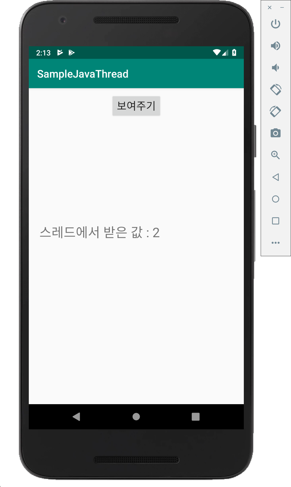
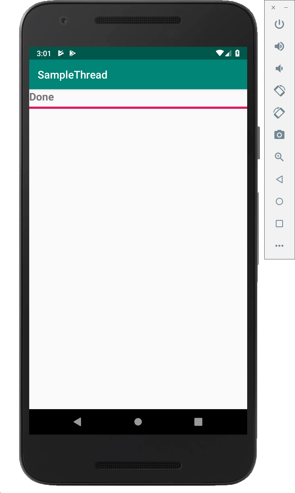
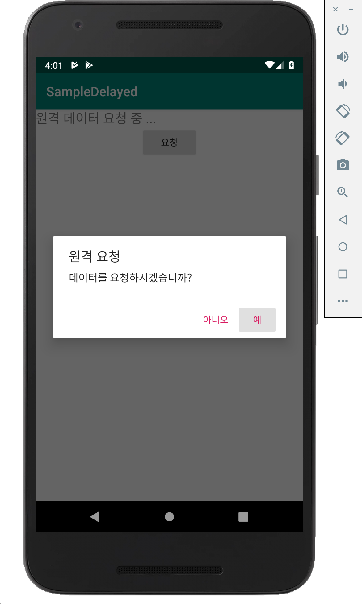
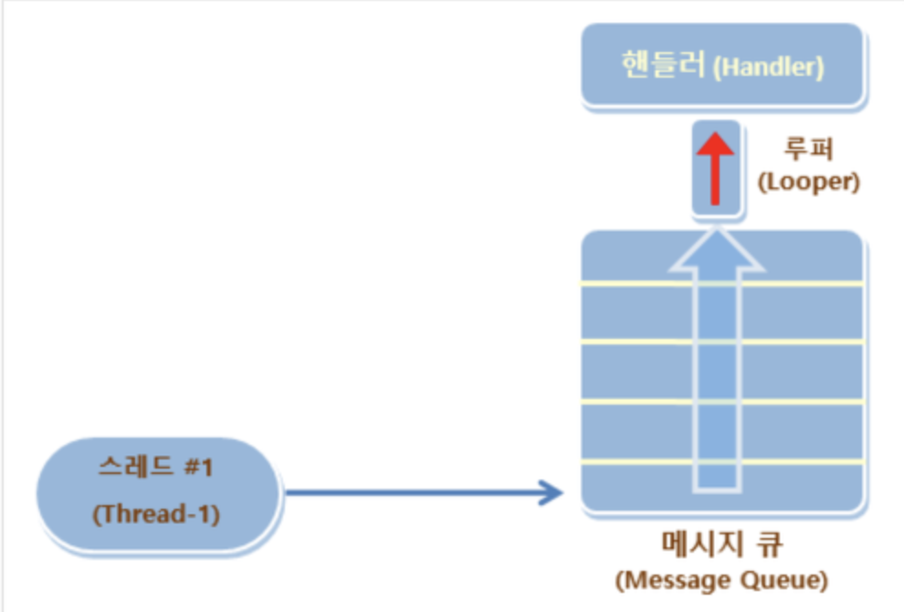
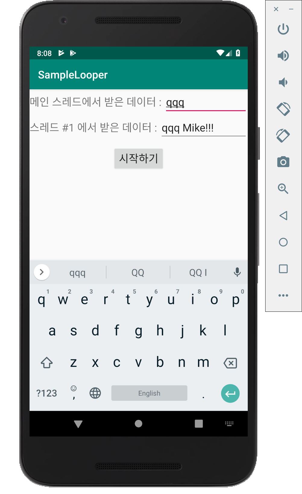
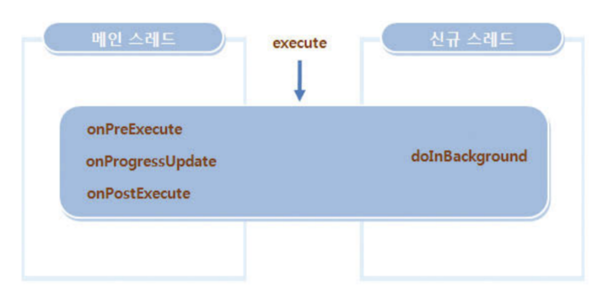
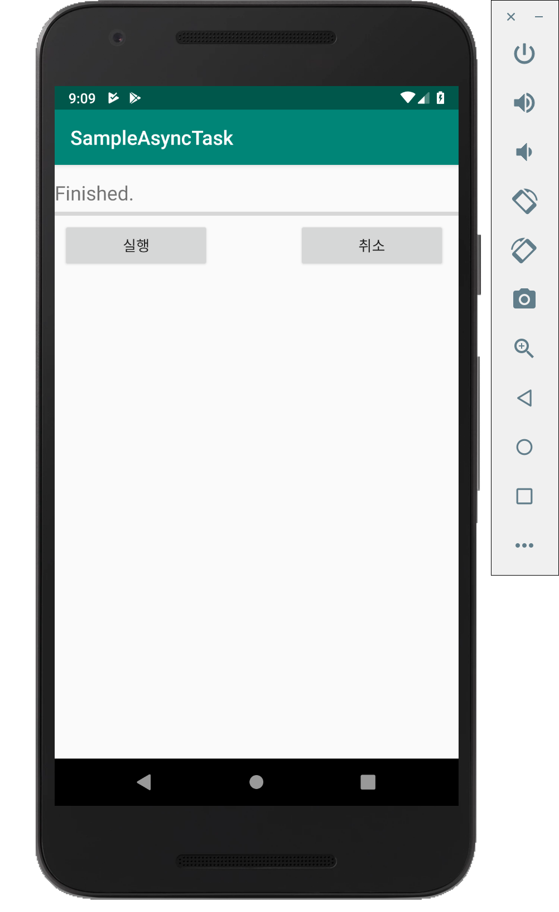
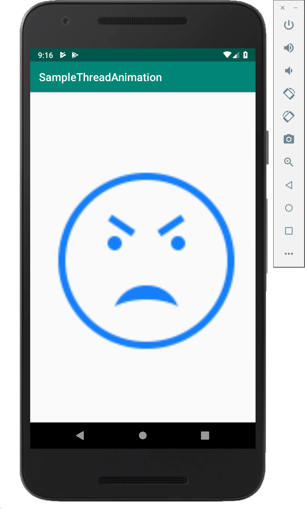

# 07-1. 핸들러 사용하기

* **스레드(Thread)** : 동시 수행이 가능한 작업 단위이며, 현재 수행되는 작업 이외의 기능을 동시에 처리하고자 할 때 새로운 스레드를 만들어 처리할 수 있다.
  * **주의할 점** : 멀티 스레드 방식은 같은 프로세스 안에 들어 있으면서 메모리 리소스를 공유하게 되므로 효율적인 처리가 가능하지만 **동시에 리소스를 접근할 경우에 데드락(DeadLock)**이 발생하여 시스템이 비정상적으로 동작할 수 있다.


* **UI를 위해 안드로이드가 제공하는 두 가지 시나리오**

  | 속성            | 설명                                                         |
  | --------------- | ------------------------------------------------------------ |
  | 서비스 사용하기 | 백그라운드 작업은 서비스로 실행하고 사용자에게는 알림 서비스를 이용해 알려준다.<br /> 만약 메인 액티비티로 결과 값을 전달하고 이를 이용해 다른 작업을 수행하고자 한다면 브로드캐스팅을 이용해 결과값을 전달할 수 있다. |
  | 스레드 사용하기 | 스레드는 동일 프로세스 내에 있기 때문에 작업 수행의 결과를 바로 처리할 수 있다.<br /> 그러나 UI 객체는 직접 접근할 수 없으므로 **핸들러(Handler)** 객체를 사용한다. |


## 자바의 스레드 사용하기

* **스레드(Thread)** 
  * new 연산자를 이용하여 객체를 생성. 
    * 파라미터가 없는 생성자
    * Runnable 객체를 파라미터로 가지는 생성자
  * start() 메소드를 호출하면 시작.


## 스레드 사용(예제)

* **/res/layout/activity_main.xml**

  ```xml
  <?xml version="1.0" encoding="utf-8"?>
  <android.support.constraint.ConstraintLayout xmlns:android="http://schemas.android.com/apk/res/android"
      xmlns:app="http://schemas.android.com/apk/res-auto"
      xmlns:tools="http://schemas.android.com/tools"
      android:layout_width="match_parent"
      android:layout_height="match_parent"
      tools:context=".MainActivity">
  
      <LinearLayout
          android:orientation="vertical"
          android:layout_width="match_parent"
          android:layout_height="match_parent">
  
          <Button
              android:layout_marginTop="10dp"
              android:layout_gravity="center_horizontal"
              android:id="@+id/button"
              android:text="보여주기"
              android:textSize="20dp"
              android:layout_width="wrap_content"
              android:layout_height="wrap_content" />
  
          <TextView
              android:id="@+id/textView"
              android:layout_marginLeft="20dp"
              android:layout_marginTop="200dp"
              android:textSize="25dp"
              android:text="스레드에서 받은 값 : X"
              android:layout_width="wrap_content"
              android:layout_height="wrap_content" />
  
      </LinearLayout>
  
  </android.support.constraint.ConstraintLayout>
  ```

* **/java/com~/MainActivity.java**

  ```java
  package com.example.samplejavathread;
  
  import android.support.v7.app.AppCompatActivity;
  import android.os.Bundle;
  import android.util.Log;
  import android.view.View;
  import android.widget.Button;
  import android.widget.TextView;
  
  public class MainActivity extends AppCompatActivity {
  
      boolean running;
  
      Integer value = 0;
      Button button;
      TextView textView;
  
      @Override
      protected void onCreate(Bundle savedInstanceState) {
          super.onCreate(savedInstanceState);
          setContentView(R.layout.activity_main);
  
          button = findViewById(R.id.button);
          textView = findViewById(R.id.textView);
  
          button.setOnClickListener(new View.OnClickListener() {
              @Override
              public void onClick(View v) {
                  // 버튼을 누르면 텍스트뷰에 현재 value에 할당된 정수 값을 표시
                  textView.setText("스레드에서 받은 값 : " + value.toString());
              }
          });
      }
  
      protected void onResume() {
          super.onResume();
  
          running = true;
  
          // 액티비티가 화면에 보이면 새로 정의한 스레드 시작
          Thread thread1 = new BackgroundThread();
          thread1.start();
      }
  
      protected void onPause() {
          super.onPause();
  
          // 액티비티가 멈추면 스레드 중지
          running = false;
          value = 0;
      }
  
      // Thread 클래스를 상속하여 새로운 스레드 정의
      class BackgroundThread extends Thread {
          public void run() {
              while(running) {
                  try {
                      // 스레드 안에서 1초마다 value의 값을 증가시킴
                      Thread.sleep(1000);
                      value++;
                  } catch (InterruptedException ex) {
                      Log.e("SampleJavaThread", "Exception in thread.", ex);
                  }
              }
          }
      }
  
  }
  ```

* **실행 결과**

  


## 메시지 전송하여 실행하기

* **메시지 큐(Message Queue)** : 앱을 실행할 때 액티비티, 브로드캐스트 수신자 등과 새로 만들어지는 윈도우를 관리한다.

* **핸들러 클래스** : 메시지 큐를 이용해 메인 스레드에서 처리할 메시지를 전달하는 역할을 한다. 핸들러를 이용하면 특정 메시지가 알맞은 시점에 실행되도록 스케줄링 할 수도 있다.

* **핸들러를 사용할 때 필요한 세 가지 단계**

  

  > 1. **obtainMessage( ) 메소드**를 이용하여 호출의 결과로 메시지 객체를 리턴받는다.
  > 2. **sendMessage( ) 메소드**를 이용해 메시지 큐에 넣을 수 있다.
  > 3. 메시지 큐에 들어간 메시지는 순서대로 핸들러가 처리하게 되며 이때**handleMessage( ) 메소드**에 정의된 기능이 수행된다.


## 메시지 전송하여 실행하기(예제)

* **/res/layout/activity_main.xml**

  ```xml
  <?xml version="1.0" encoding="utf-8"?>
  <android.support.constraint.ConstraintLayout xmlns:android="http://schemas.android.com/apk/res/android"
      xmlns:app="http://schemas.android.com/apk/res-auto"
      xmlns:tools="http://schemas.android.com/tools"
      android:layout_width="match_parent"
      android:layout_height="match_parent"
      tools:context=".MainActivity">
  
      <LinearLayout
          android:orientation="vertical"
          android:layout_width="match_parent"
          android:layout_height="match_parent">
  
          <TextView
              android:id="@+id/textView"
              android:text="Working ..."
              android:textSize="20dp"
              android:textStyle="bold"
              android:layout_width="wrap_content"
              android:layout_height="wrap_content" />
  
          <ProgressBar
              android:id="@+id/progress"
              style="?android:attr/progressBarStyleHorizontal"
              android:max="100"
              android:layout_width="match_parent"
              android:layout_height="wrap_content" />
  
      </LinearLayout>
  
  </android.support.constraint.ConstraintLayout>
  ```

* **/java/com~/MainActivity.java**

  ```java
  package com.example.samplethread;
  
  import android.os.Handler;
  import android.os.Message;
  import android.support.v7.app.AppCompatActivity;
  import android.os.Bundle;
  import android.util.Log;
  import android.widget.ProgressBar;
  import android.widget.TextView;
  
  public class MainActivity extends AppCompatActivity {
  
      TextView textView;
      ProgressBar progressBar;
  
      // 새로 정의한 핸들러의 변수 선언
      ProgressHandler handler;
  
      boolean isRunning;
  
      @Override
      protected void onCreate(Bundle savedInstanceState) {
          super.onCreate(savedInstanceState);
          setContentView(R.layout.activity_main);
  
          textView = findViewById(R.id.textView);
          progressBar = findViewById(R.id.progress);
  
          // 액티비티가 만들어질 때 핸들러 객체 생성
          handler = new ProgressHandler();
      }
  
      public void onStart() {
          super.onStart();
  
          // 프로그레스바 값 설정
          progressBar.setProgress(0);
  
          // 액티비티가 시작될 때 스레드를 만들어 시작
          Thread thread1 = new Thread(new Runnable() {
              @Override
              public void run() {
                  try {
                      for (int i = 0; i < 20 && isRunning; i++) {
                          // 핸들러로 메시지 전송
                          // 스레드 안에서 필요한 경우 작업 상태나
                          // 결과를 핸들러의 sendMessage() 메소드로 전송
                          Thread.sleep(1000);
                          Message msg = handler.obtainMessage();
                          handler.sendMessage(msg);
                      }
                  } catch (Exception ex) {
                      Log.e("MainActivity", "Exception in processing message", ex);
                  }
              }
          });
  
          isRunning = true;
          thread1.start();
      }
  
      public void onStop() {
          super.onStop();
  
          isRunning = false;
      }
  
      // Handler 클래스를 상속하여 새로운 핸들러 클래스 정의
      public class ProgressHandler extends Handler {
          // 전달된 메시지를 처리하는 handleMessage() 메소드 안에서
          // 프로그레스바의 값 업데이트
          public void handleMessage(Message msg) {
              progressBar.incrementProgressBy(5);
              if (progressBar.getProgress() == progressBar.getMax()) {
                  textView.setText("Done");
              } else {
                  textView.setText("Working ..." + progressBar.getProgress());
              }
          }
      }
  }
  ```

* **실행 결과**

  

  

## Runnable 객체 생성하기

: 새로 만든 Runnable 객체를 핸들러의 **post() 메소드**를 이용해 전달해 주기만 하면 이 객체에 정의된 **run() 메소드** 내의 코드들을 메인 스레드에서 실행 된다.


##Runnable 객체 생성하기(예제) 

* **/res/layout/activity_main.xml**

  ```xml
  <?xml version="1.0" encoding="utf-8"?>
  <android.support.constraint.ConstraintLayout xmlns:android="http://schemas.android.com/apk/res/android"
      xmlns:app="http://schemas.android.com/apk/res-auto"
      xmlns:tools="http://schemas.android.com/tools"
      android:layout_width="match_parent"
      android:layout_height="match_parent"
      tools:context=".MainActivity">
  
      <LinearLayout
          android:orientation="vertical"
          android:layout_width="match_parent"
          android:layout_height="match_parent">
  
          <TextView
              android:id="@+id/textView"
              android:text="Working ..."
              android:textSize="20dp"
              android:textStyle="bold"
              android:layout_width="wrap_content"
              android:layout_height="wrap_content" />
  
          <ProgressBar
              android:id="@+id/progress"
              style="?android:attr/progressBarStyleHorizontal"
              android:max="100"
              android:layout_width="match_parent"
              android:layout_height="wrap_content" />
  
      </LinearLayout>
  
  </android.support.constraint.ConstraintLayout>
  ```

* **/java/com~/MainActivity.java**

  ```java
  package com.example.samplethreadrunnableactivity;
  
  import android.os.Handler;
  import android.support.v7.app.AppCompatActivity;
  import android.os.Bundle;
  import android.util.Log;
  import android.widget.ProgressBar;
  import android.widget.TextView;
  
  public class MainActivity extends AppCompatActivity {
  
      TextView textView;
      ProgressBar progressBar;
  
      // 핸들러 변수 선언
      Handler handler;
  
      // 새로 정의한 Runnable 객체의 변수 선언
      ProgressRunnable runnable;
  
      boolean isRunning;
  
      @Override
      protected void onCreate(Bundle savedInstanceState) {
          super.onCreate(savedInstanceState);
          setContentView(R.layout.activity_main);
  
          textView = findViewById(R.id.textView);
          progressBar = findViewById(R.id.progress);
  
          // 액티비티가 만들어질 때 핸들러와 Runnable 객체 생성
          handler = new Handler();
          runnable = new ProgressRunnable();
      }
  
      public void onStart() {
          super.onStart();
  
          // 스레드 시
          progressBar.setProgress(0);
          // 액티비티가 시작될 때 스레드 시작
          Thread thread1 = new Thread(new Runnable() {
              public void run() {
                  try {
                      for (int i = 0; i < 20 && isRunning; i++) {
                          Thread.sleep(1000);
  
                          // 스레드의 결과물을 화면에 표시하기 위해
                          // 핸들러 객체의 post() 메소드를 호출하면서
                          // 새로 생성한 Runnable 객체 전달
                          handler.post(runnable);
                      }
                  } catch (Exception ex) {
                      Log.e("SampleThreadActivity", "Exception in processing message.", ex);
                  }
              }
          });
  
          isRunning = true;
          thread1.start();
      }
  
      public void onStop() {
          super.onStop();
  
          isRunning = false;
      }
  
      // Runnable 인터페이스를 구현하는 새로운 클래스를
      // 정의하고 run() 메소드 안에 실행 코드 정의
      public class ProgressRunnable implements Runnable {
          public void run() {
              // 프로그레스바의 값을 5씩 증
              progressBar.incrementProgressBy(5);
  
              if (progressBar.getProgress() == progressBar.getMax()) {
                  textView.setText("Runnable Done");
              } else {
                  textView.setText("Runnable Working ..." + progressBar.getProgress());
              }
          }
      }
  }
  ```

* **실행 결과**

  

* **코드 구조**

  :  새로 만들어진 스레드 안에서 핸들러 객체에 정의된 post() 메소드를 호출하면서 Runnable 객체를 전달하면 그 안에 정의된 run() 메소드 내의 코드가 메인 스레드에서 실행되면서 프로그레스바의 값을 바꿔주는 구조이다.


# 07-2. 일정 시간 후에 실행하기

: 메인 스레드 내에서 지연 시간을 주는 것만으로도 UI의 멈춤 현상을 방지할 수 있다.


## 원격 서버에 요청하는 상황을 가정(예제)

* **/res/layout/activity_main.xml**

  ```xml
  <?xml version="1.0" encoding="utf-8"?>
  <android.support.constraint.ConstraintLayout xmlns:android="http://schemas.android.com/apk/res/android"
      xmlns:app="http://schemas.android.com/apk/res-auto"
      xmlns:tools="http://schemas.android.com/tools"
      android:layout_width="match_parent"
      android:layout_height="match_parent"
      tools:context=".MainActivity">
  
      <LinearLayout
          android:orientation="vertical"
          android:layout_width="match_parent"
          android:layout_height="match_parent">
  
          <TextView
              android:id="@+id/textView"
              android:textSize="20dp"
              android:layout_width="wrap_content"
              android:layout_height="wrap_content"
              android:text="네트워크 지연 시간 시뮬레이션"
              />
  
          <Button
              android:id="@+id/button"
              android:text="요청"
              android:layout_gravity="center_horizontal"
              android:layout_width="wrap_content"
              android:layout_height="wrap_content" />
  
      </LinearLayout>
  
  </android.support.constraint.ConstraintLayout>
  ```

* **/java/com~/MainActivity.java**

  ```java
  package com.example.sampledelayed;
  
  import android.content.DialogInterface;
  import android.support.v7.app.AlertDialog;
  import android.support.v7.app.AppCompatActivity;
  import android.os.Bundle;
  import android.view.View;
  import android.widget.Button;
  import android.widget.TextView;
  
  public class MainActivity extends AppCompatActivity {
  
      TextView textView;
      Button button;
  
      @Override
      protected void onCreate(Bundle savedInstanceState) {
          super.onCreate(savedInstanceState);
          setContentView(R.layout.activity_main);
  
          textView = findViewById(R.id.textView);
          button = findViewById(R.id.button);
  
          button.setOnClickListener(new View.OnClickListener() {
              @Override
              public void onClick(View v) {
                  // 버튼을 누르면 새로 정의한 request() 메소드 호출
                  request();
              }
          });
  
      }
  
      private void request() {
          String title = "원격 요청";
          String message = "데이터를 요청하시겠습니까?";
          String titleButtonYes = "예";
          String titleButtonNo = "아니오";
  
          // request() 메소드 안에서는 대화상자를 만들어 화면에 보여줌
          AlertDialog dialog = makeRequestDialog(title, message, titleButtonYes, titleButtonNo);
          dialog.show();
  
          textView.setText("원격 데이터 요청 중 ...");
      }
  
      private AlertDialog makeRequestDialog(CharSequence title, CharSequence message,
                                            CharSequence titleButtonYes, CharSequence titleButtonNo) {
  
          AlertDialog.Builder requestDialog = new AlertDialog.Builder(this);
          requestDialog.setTitle(title);
          requestDialog.setMessage(message);
  
          // 새로 정의한 makeRequestDialog() 안에서 대화상자를 만들 때
          // [예] 버튼을 누르면 10초 동안 대기한 후 텍스트뷰에 완료 표시
          requestDialog.setPositiveButton(titleButtonYes, new DialogInterface.OnClickListener() {
              @Override
              public void onClick(DialogInterface dialog, int which) {
                  for (int k = 0; k < 10; k++) {
                      try {
                          Thread.sleep(1000);
                      } catch (InterruptedException ex) { }
                  }
                  textView.setText("원격 데이터 요청 완료.");
              }
          });
  
          requestDialog.setNegativeButton(titleButtonNo, new DialogInterface.OnClickListener() {
              @Override
              public void onClick(DialogInterface dialog, int which) {
  
              }
          });
  
          return requestDialog.show();
      }
  }
  ```

* **실행 결과**

  

  

  > **멈춤 현상 발생!!**

* **핸들러의 특정 메소드를 이용**

  : 네트워킹을 위한 별도의 스레드를 만들지 않고 문제를 해결하는 방법

  ```java
  // 메시지를 보낼 때 시간을 지정할 수 있다.
  public boolean sendMessageAtTime(Message msg, long uptimeMillis);
  // 메시지가 일정 시간이 지난 후 실행되도록 설정할 수 있다.
  public boolean sendMessageDelayed(Message msg, long delayMillis);
  ```

* **위의 예제를 수정한 코드**

  /java/com~/MainActivity2.java

  ```java
  private AlertDialog makeRequestDialog(CharSequence title, CharSequence message, CharSequence titleButtonYes, CharSequence titleButtonNo) {
  
    ...
    
    requestDialog.setPositiveButton(titleButtonYes, new DialogInterface.OnClickListener() {
      @Override
      public void onClick(DialogInterface dialog, int which) {
        // 대화상자의 [예] 버튼을 누르면 새로 정의한
        // 핸들러 객체를 만들고 난 후 지연 시간을 두고
        // 메시지 전송
        RequestHandler handler = new RequestHandler();
        handler.sendEmptyMessageDelayed(0, 20);
    });
      
      ...
  }
                   
  // Handler 클래스를 상속하여 새로 정의한 RequestHandler는 이전과 동일하게 사용
  class RequestHandler extends Handler {
    public void handleMessage(Message msg) {
      for (int k = 0; k < 10; k++) {
        try {
          Thread.sleep(1000);
        } catch (InterruptedException ex) {} 
      }
      textView.setText("원격 데이터 요청 완료") 
    }  
  }
  ```

  > 앱을 실행하면 대화상자가 없어지고 나서 원격 요청 코드가 실행되는 것을 볼 수 있다.


# 07-3. 스레드로 메시지 전송하기

* 별도의 스레드가 동일한 객체에 접근할 때 다른 스레드들이 동시에 메소드를 호출하는 경우가 있을 수 있으므로 메시지 큐를 이용한 접근 방식에 대해 이해할 필요가 있다.

* 핸들러가 처리하는 메시지 큐는 **루퍼(Looper)**를 통해 처리되는데 그 과정은 일반적인 이벤트 처리 과정과 유사하다.

  

  * **루퍼** : 무한 루프 방식을 이용해 메시지 큐에 들어오는 메시지를 지속적으로 보면서 하나씩 처리하게 된다.
    * 메인 스레드나 다른 스레드에서 메시지 전송 방식으로 스레드에 데이터를 전달한 후 작업을 순차적으로 수행하고 싶다면 루퍼를 만든 후 실행해야 한다.


## 스레드로 메시지 전송하기(예제)

* **/res/layout/activity_main.xml**

  ```xml
  <?xml version="1.0" encoding="utf-8"?>
  <android.support.constraint.ConstraintLayout xmlns:android="http://schemas.android.com/apk/res/android"
      xmlns:app="http://schemas.android.com/apk/res-auto"
      xmlns:tools="http://schemas.android.com/tools"
      android:layout_width="match_parent"
      android:layout_height="match_parent"
      tools:context=".MainActivity">
  
      <LinearLayout
          android:orientation="vertical"
          android:layout_width="match_parent"
          android:layout_height="match_parent">
  
          <LinearLayout
              android:orientation="horizontal"
              android:layout_width="match_parent"
              android:layout_height="wrap_content">
  
              <TextView
                  android:text="메인 스레드에서 받은 데이터 : "
                  android:textSize="20dp"
                  android:layout_width="wrap_content"
                  android:layout_height="wrap_content" />
  
              <EditText
                  android:id="@+id/mainEdit"
                  android:textSize="20dp"
                  android:layout_width="match_parent"
                  android:layout_height="wrap_content" />
  
          </LinearLayout>
  
          <LinearLayout
              android:orientation="horizontal"
              android:layout_width="match_parent"
              android:layout_height="wrap_content">
  
              <TextView
                  android:text="스레드 #1 에서 받은 데이터 : "
                  android:textSize="20dp"
                  android:layout_width="wrap_content"
                  android:layout_height="wrap_content" />
  
              <EditText
                  android:id="@+id/ThreadEdit"
                  android:textSize="20dp"
                  android:layout_width="match_parent"
                  android:layout_height="wrap_content" />
  
          </LinearLayout>
  
          <Button
              android:layout_marginTop="10dp"
              android:layout_gravity="center_horizontal"
              android:id="@+id/button"
              android:text="시작하기"
              android:textSize="20dp"
              android:layout_width="wrap_content"
              android:layout_height="wrap_content" />
  
      </LinearLayout>
  
  </android.support.constraint.ConstraintLayout>
  ```

* **/java/com~/MainActivity.java**

  ```java
  package com.example.samplelooper;
  
  import android.os.Handler;
  import android.os.Looper;
  import android.os.Message;
  import android.support.v7.app.AppCompatActivity;
  import android.os.Bundle;
  import android.view.View;
  import android.widget.Button;
  import android.widget.EditText;
  
  public class MainActivity extends AppCompatActivity {
  
      EditText mainText;
      EditText threadText;
      Button button;
  
      MainHandler mainHandler;
      ProcessThread thread1;
  
      @Override
      protected void onCreate(Bundle savedInstanceState) {
          super.onCreate(savedInstanceState);
          setContentView(R.layout.activity_main);
  
          mainText = findViewById(R.id.mainEdit);
          threadText = findViewById(R.id.ThreadEdit);
          button = findViewById(R.id.button);
  
          mainHandler = new MainHandler();
  
          // 새로 정의한 스레드 객체 생성
          thread1 = new ProcessThread();
  
          button.setOnClickListener(new View.OnClickListener() {
              @Override
              public void onClick(View v) {
                  String inStr = mainText.getText().toString();
                  Message msgToSend = Message.obtain();
                  msgToSend.obj = inStr;
  
                  // 버튼을 눌렀을 때 스레드 내의 핸들러로 메시지 전송
                  thread1.handler.sendMessage(msgToSend);
              }
          });
  
          thread1.start();
      }
  
      class ProcessThread extends Thread {
          // 스레드 내에 선언된 핸들러 객체
          ProcessHandler handler;
  
          public ProcessThread() {
              handler = new ProcessHandler();
          }
  
          // 스레드의 run() 메소드 안에서 루퍼 실행
          public void run() {
              Looper.prepare();
              Looper.loop();
          }
      }
  
      class ProcessHandler extends Handler {
          public void handleMessage(Message msg) {
              Message resultMsg = Message.obtain();
              resultMsg.obj = msg.obj + " Mike!!!";
  
              // 스레드 내의 핸들러에서 메인 스레드와
              // 핸들러로 메시지 전송
              mainHandler.sendMessage(resultMsg);
          }
      }
  
      class MainHandler extends Handler {
          public void handleMessage(Message msg) {
              String str = (String) msg.obj;
  
              // 메인 스레드의 핸들러 내에서 입력상자의 메시지 표시
              threadText.setText(str);
          }
      }
  }
  ```

* **실행 결과**

  

  > 내부적으로는 메인 스레드에서 새로 만든 별도의 스레드로 Message 객체를 전송하고, 별도의 스레드에서는 전달받은 문자열에 다른 문자열을 덧붙여 메인 스레드 쪽으로 다시 전송하는 과정을 거치게 된다.


# 07-4. AsyncTask 사용하기

* **AsyncTask 클래스** : 백그라운드 작업을 좀 더 쉽고 간단하게 할 수 있다. 이 클래스를 상속하여 새로운 클래스를 만들면 그 안에 스레드를 위한 코드와 UI 접근 코드를 한꺼번에 넣을 수 있다.

* **AsyncTask 실행되는 방식**

  

  > AsyncTask 객체를 만들고 **excute( ) 메소드**를 실행하면 이 객체는 정의된 백그라운드 작업을 수행하고 필요한 경우에 그 결과를 메인 스레드에서 실행하므로 UI 객체에 접근하는데 문제가 없게 된다.

* **AsyncTask 메소드들**

  * **doInBackground() 메소드** : 새로 만들어진 스레드에서 실행되어야 할 코드들을 포함하게 된다.

  * **onPreExecute(), onProgressUpdate(), onPostExecute() 메소드** : 이 메소드들은 메인 스레드에서 실행되므로 UI 객체에 자유롭게 접근할 수 있다.

    | 메소드 이름      | 설명                                                         |
    | ---------------- | ------------------------------------------------------------ |
    | doInBackground   | 새로 만든 스레드에서 백그라운드 작업을 수행.<br />execute() 메소드를 호출할 때 사용된 파라미터를 배열로 전달받는다. |
    | onPreExecute     | 백그라운드 작업을 수행하기 전에 호출.<br />메인 스레드에서 실행되며 초기화 작업에 사용 |
    | onProgressUpdate | 백그라운드 작업의 진행 상태를 표시하기 위해 호출.<br />작업 수행 중간 중간에 UI 객체에 접근하는 경우에 사용.<br />이 메소드가 호출되도록 하려면 백그라운드 작업 중간에 publicProgress()<br />메소드를 호출해야 한다. |
    | onPostExecute    | 백그라운드 작업이 끝난 후 호출.<br />메인 스레드에서 실행되며 메모리 리소스를 해체하는 등의 작업에 사용된다.<br />백그라운드 작업의 결과는 Result 타입의 파라미터로 전달된다. |

    > **cancel( ) 메소드** : 작업을 취소하는 메소드. 이 메소드를 통해 작업을 취소하면 **onCancelled() 메소드**가 호출된다.
    >
    > **getStatus( ) 메소드** : 작업의 진행 상황을 확인하고 싶은 경우 사용. 각각의 상태는 **PENDING, RUNNING, FINISHED** 로 구분.


## AsyncTask 메소드로 백그라운드에서 작업(예제)

* **/res/layout/activity_main.xml**

  ```xml
  <?xml version="1.0" encoding="utf-8"?>
  <android.support.constraint.ConstraintLayout xmlns:android="http://schemas.android.com/apk/res/android"
      xmlns:app="http://schemas.android.com/apk/res-auto"
      xmlns:tools="http://schemas.android.com/tools"
      android:layout_width="match_parent"
      android:layout_height="match_parent"
      tools:context=".MainActivity">
  
      <LinearLayout
          android:orientation="vertical"
          android:layout_width="match_parent"
          android:layout_height="match_parent">
  
          <TextView
              android:id="@+id/textView"
              android:layout_marginTop="15dp"
              android:text="AsyncTask를 이용한 백그라운드 작업"
              android:textSize="20dp"
              android:layout_width="match_parent"
              android:layout_height="wrap_content" />
  
          <ProgressBar
              android:id="@+id/progress"
              style="?android:attr/progressBarStyleHorizontal"
              android:max="100"
              android:layout_width="match_parent"
              android:layout_height="wrap_content" />
  
          <LinearLayout
              android:layout_gravity="center_horizontal"
              android:orientation="horizontal"
              android:layout_width="match_parent"
              android:layout_height="wrap_content">
  
              <Button
                  android:id="@+id/executeButton"
                  android:text="실행"
                  android:textSize="15dp"
                  android:layout_marginLeft="8dp"
                  android:layout_width="150dp"
                  android:layout_height="wrap_content" />
  
              <Button
                  android:id="@+id/cancelButton"
                  android:layout_marginLeft="90dp"
                  android:text="취소"
                  android:textSize="15dp"
                  android:layout_width="150dp"
                  android:layout_height="wrap_content" />
  
          </LinearLayout>
  
      </LinearLayout>
  
  </android.support.constraint.ConstraintLayout>
  ```

* **/java/com~/MainActivity.java**

  ```java
  package com.example.sampleasynctask;
  
  import android.os.AsyncTask;
  import android.support.v7.app.AppCompatActivity;
  import android.os.Bundle;
  import android.view.View;
  import android.widget.Button;
  import android.widget.ProgressBar;
  import android.widget.TextView;
  
  public class MainActivity extends AppCompatActivity {
  
      ProgressBar progressBar;
      Button executeBtn;
      Button cancelBtn;
      TextView textView;
  
      // 새로 정의한 BackgroundTask 객체 선언
      BackgroundTask task;
      int value;
  
      @Override
      protected void onCreate(Bundle savedInstanceState) {
          super.onCreate(savedInstanceState);
          setContentView(R.layout.activity_main);
  
          progressBar = findViewById(R.id.progress);
          executeBtn = findViewById(R.id.executeButton);
          cancelBtn = findViewById(R.id.cancelButton);
          textView = findViewById(R.id.textView);
  
          executeBtn.setOnClickListener(new View.OnClickListener() {
              @Override
              public void onClick(View v) {
                  // [실행] 버튼을 눌렀을 때
                  // 새로 정의한 BackgroundTask
                  // 객체 생성과 execute() 메소드 실행
                  task = new BackgroundTask();
                  task.execute(100);
              }
          });
  
          cancelBtn.setOnClickListener(new View.OnClickListener() {
              @Override
              public void onClick(View v) {
                  // [취소] 버튼을 눌렀을 때
                  // cancel() 메소드 실행
                  task.cancel(true);
              }
          });
      }
  
      // AsyncTask를 상속하여 새로운
      // BackgroundTask 클래스 정의
      // 제네릭
      // 첫 번째 파라미터 : doInBackground 파라미터
      // 두 번째 파라미터 : onProgressUpdate 파라미터
      // 세 번째 파라미터 : onPostExecute 파라미터
      class BackgroundTask extends AsyncTask<Integer, Integer, Integer> {
          protected void onPreExecute() {
              value = 0;
              progressBar.setProgress(value);
          }
  
          protected Integer doInBackground(Integer ... values) {
              while (isCancelled() == false) {
                  value++;
                  if (value >= 100) {
                      break;
                  } else {
                      // doInBackground() 메소드 내에서
                      // publishProgress() 메소드 호출
                      // UI 업데이트
                      publishProgress(value);
                  }
  
                  try {
                      Thread.sleep(100);
                  } catch (InterruptedException ex) {}
              }
              return value;
          }
  
          // onProgressUpdate() 메소드 내에서
          // 프로그래스바의 텍스트뷰 변경
          protected void onProgressUpdate(Integer ... values) {
              progressBar.setProgress(values[0].intValue());
              textView.setText("Current Value : " + values[0].toString());
          }
  
          protected void onPostExecute(Integer result) {
              progressBar.setProgress(0);
              textView.setText("Finished.");
          }
  
          protected void onCancelled() {
              progressBar.setProgress(0);
              textView.setText("Cancelled.");
          }
  
      }
  }
  
  ```

* **실행 결과**

  

  

# 07-5. 스레드로 애니메이션 만들기

 여러 이미지를 연속으로 바꾸면서 애니메이션 효과를 만들고 싶을 때 **스레드** 이용.


## 스레드로 간단히 애니메이션 만들기(예제)

* **/res/layout/activity_main.xml**

  ```xml
  <?xml version="1.0" encoding="utf-8"?>
  <android.support.constraint.ConstraintLayout xmlns:android="http://schemas.android.com/apk/res/android"
      xmlns:app="http://schemas.android.com/apk/res-auto"
      xmlns:tools="http://schemas.android.com/tools"
      android:layout_width="match_parent"
      android:layout_height="match_parent"
      tools:context=".MainActivity">
  
      <ImageView
          android:id="@+id/imageView"
          android:layout_width="match_parent"
          android:layout_height="match_parent" />
  
  </android.support.constraint.ConstraintLayout>
  ```

* **/java/com~/MainActivity.java**

  ```java
  package com.example.samplethreadanimation;
  
  import android.content.res.Resources;
  import android.graphics.drawable.Drawable;
  import android.os.Handler;
  import android.support.v7.app.AppCompatActivity;
  import android.os.Bundle;
  import android.widget.ImageView;
  
  import java.util.ArrayList;
  
  public class MainActivity extends AppCompatActivity {
  
      ImageView imageView;
  
      // 이미지 객체를 넣어둘 리스트
      ArrayList<Drawable> drawableList = new ArrayList<Drawable>();
  
      Handler handler = new Handler();
  
      @Override
      protected void onCreate(Bundle savedInstanceState) {
          super.onCreate(savedInstanceState);
          setContentView(R.layout.activity_main);
  
          imageView = findViewById(R.id.imageView);
  
          startAnimation();
      }
  
      public void startAnimation() {
          Resources res = getResources();
  
          drawableList.add(res.getDrawable(R.drawable.face1));
          drawableList.add(res.getDrawable(R.drawable.face2));
          drawableList.add(res.getDrawable(R.drawable.face3));
          drawableList.add(res.getDrawable(R.drawable.face4));
          drawableList.add(res.getDrawable(R.drawable.face5));
  
          AnimThread thread = new AnimThread();
          thread.start();
      }
  
      // 이미지를 사용해 애니메이션을 구현하는 스레드
      class AnimThread extends Thread {
          public void run() {
              int index = 0;
              // 스레드를 실행하면 다섯 개의 이미지를
              // 번갈아 가면서 화면에 보여준다.
              for (int i = 0; i < 100; i++) {
                  // 이미지 파일 로딩
                  final Drawable drawable = drawableList.get(index);
                  index += 1;
                  if (index > 4) {
                      index = 0;
                  }
  
                  handler.post(new Runnable() {
                      @Override
                      public void run() {
                          // 이미지뷰를 설정한다.
                          imageView.setImageDrawable(drawable);
                      }
                  });
  
                  try {
                      Thread.sleep(500);
                  } catch (Exception e) {
                      e.printStackTrace();
                  }
              }
          }
      }
  }
  ```

* **실행 결과**

  


