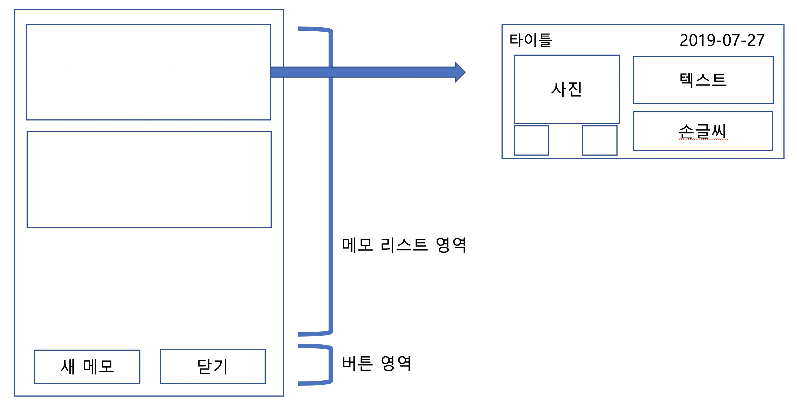

# 01. 멀티메모 앱

# 01-1. 멀티메모의 개요

사용자가 입력하여 저장한 메모들은 잘 관리될 필요가 있으므로 단말기 내부의 데이터베이스에 저장되며 필요에 따라 조회될 수 있다.

* **기본 메모 앱에서 화면 기능과 데이터베이스 처리 과정**

  1. **메모 리스트 조회** 

     : 데이터 베이스에서 전체 데이터를 조회할 수 있는 SQL을 만들어 실행한다.

  2. **메모 추가**

     : 새로운 메모를 추가하려면 메모 입력창으로 전환. 메모 입력창에서 새로운 내용을 입력한 후 [저장] 버튼을 누르면 데이터베이스에 메모 내용을 저장

  3. **메모 수정**

     : 메모 수정 버튼을 누르면 입력창으로 전환되면서 선택한 메모의 내용이 보이게 된다. 그리고 내용을 수정한 후에 저장 버튼을 누르면 데이터베이스에 저장된다.

  4. **메모 삭제**

     : 메모 리스트에 있는 메모 삭제 버튼을 누르면 '삭제하시겠습니까?'와 같은 확인 대화상자를 보여준 후에 데이터베이스에 저장되어 있는 메모 삭제

* **멀티메모 앱의 기능 정리**

  1. **멀티메모 앱**

     : 텍스트 메모 기능. 텍스트 입력과 텍스트 수정/삭제 기능을 포함하고 있다.

  2. **손글씨 메모**

     : 손가락으로 직접 터치하여 글씨를 쓰는 기능

  3. **사진**

     : 사진을 저장하고 볼 수 있는 기능

  4. **동영상**

     : 동영상을 녹화하거나 재생하는 기능

* **멀티메모 앱의 단계별 구성**
  1. 메인 화면의 XML 레이아웃을 구성합니다. 메인 화면에는 저장된 메모 리스트가 보이게 되는데 이 리스트의 각 아이템에는 텍스트 메모, 손글씨 메모, 사진, 음섬, 동영상 중에서 저장된 정보가 있을 때 해당 내용이 나타나게 된다.
  2. 데이터를 저장할 수 있도록 데이터베이스 기능을 추가합니다. 데이터베이스에 만들어진 테이블에 메모 데이터를 추가할 수 있도록 메모 입력화면의 XML 레이아웃을 구성한 후 사진 기능을 추가한다.
  3. 손글씨 기능을 추가한다. 손글씨를 입력할 때는 선의 색상이나 굵기를 선택하는 기능들이 같이 있어야 하므로 페인트보드를 이용해 별도의 손글씨 입력화면을 만들고 손글씨 입력이 끝나면 데이터베이스에 저장하도록 기존 코드를 수정한다.
  4. 음성 기능과 동영상 기능을 추가한다. 음성 기능에는 음성 녹음과 재생이 포함되고 동영상 기능에는 동영상 녹화와 재생 기능이 포함된다. 음성 녹음과 동영상 녹화의 경우에도 입력이 끝나면 데이터베이스에 저장되도록 기존 코드를 수정한다.

# 01-2. 1단계 - 메인 화면 구성하기

